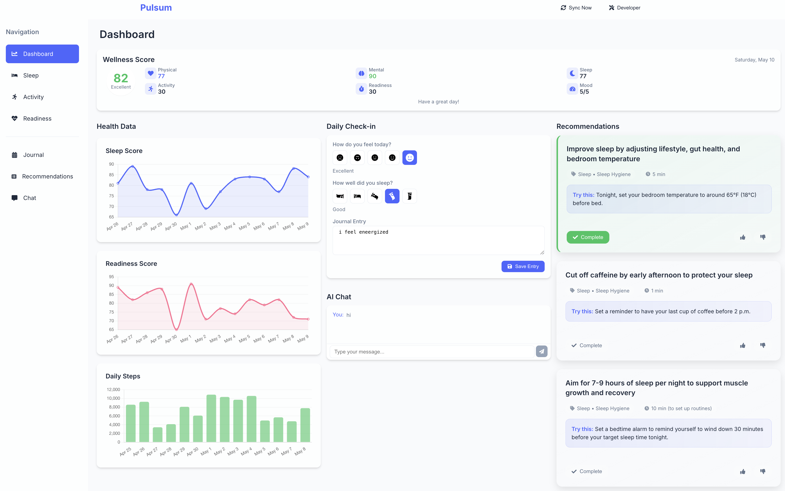

# Pulsum Wellness App

A comprehensive wellness dashboard powered by a sophisticated multi-agent AI architecture that integrates with Oura and Dexcom APIs to provide personalized health insights and recommendations.



## AI-Powered Wellness Intelligence

At the core of Pulsum is its intelligent multi-agent system that analyzes your health data to provide personalized insights:

```
┌─────────────────────────────────────────────────────────────────┐
│                         Manager Agent                           │
│                                                                 │
│        Orchestrates all agent interactions, user queries,       │
│            and coordinates the complete workflow                │
└─────────┬─────────────┬─────────────┬─────────────┬─────────────┘
          │             │             │             │
          ▼             ▼             ▼             ▼
┌─────────────────┐ ┌─────────────┐ ┌─────────────┐ ┌─────────────────┐
│ Recommendation  │ │ Pattern     │ │ Safety      │ │ Sentiment       │
│ Agent           │ │ Detection   │ │ Agent       │ │ Journal Agent   │
│                 │ │ Agent       │ │             │ │                 │
│ Matches health  │ │ Identifies  │ │ Monitors    │ │ Analyzes journal│
│ data with       │ │ trends and  │ │ for health  │ │ entries for     │
│ evidence-based  │ │ correlations│ │ risk factors│ │ emotional data  │
│ actions         │ │ in data     │ │             │ │                 │
└────────┬────────┘ └──────┬──────┘ └──────┬──────┘ └────────┬────────┘
         │                 │               │                  │
         │                 ▼               │                  │
         │          ┌─────────────┐        │                  │
         └────────►│ Personali-  │◄───────┘                  │
                   │ zation Agent │◄─────────────────────────┘
                   │             │
                   │ Adapts to   │
                   │ preferences │
                   │ and feedback│
                   └──────┬──────┘
                          │
                          ▼
                   ┌─────────────┐
                   │ Micro-      │
                   │ Actions DB  │
                   └─────────────┘
```

### Complete Agent System

- **Manager Agent**: Coordinates the entire AI workflow, routes user queries, and orchestrates interactions between specialized agents
- **Recommendation Agent**: Analyzes health data to generate actionable insights matched to evidence-based micro-actions
- **Pattern Detection Agent**: Identifies trends, correlations, and anomalies across multiple health metrics
- **Safety Agent**: Monitors for potential health risks and ensures recommendations are safe based on user's health profile
- **Sentiment Journal Agent**: Analyzes journal entries to extract emotional states and subjective wellness factors
- **Personalization Agent**: Customizes recommendations based on user preferences, feedback history, and sentiment analysis
- **Reinforcement Learning**: The system continuously improves through user feedback on recommendations

## Key Features

- **Multi-Modal Health Analysis**: AI agents process data from wearables, journaling, and user feedback to create a comprehensive health picture
- **Pattern Recognition**: Advanced algorithms detect subtle correlations between sleep, activity, glucose, and subjective metrics
- **Personalized Safety Guardrails**: The Safety Agent ensures all recommendations are appropriate for your specific health situation
- **Emotional Intelligence**: Sentiment analysis of journal entries helps the system understand subjective wellness factors
- **Adaptive Recommendations**: As you provide feedback, the system learns your preferences and health responses
- **Natural Language Interface**: Communicate with your wellness assistant through a chat interface for insights and custom recommendations
- **Micro-action Library**: Access to hundreds of evidence-based health interventions specifically matched to your current health state
- **Local Data Processing**: All your sensitive health data stays on your local machine, with AI processing happening securely

## Tech Stack

- **Frontend**: React, Chart.js, TailwindCSS
- **Backend**: Node.js, Express
- **Database**: SQLite
- **AI**: OpenAI API for multi-agent system

## Requirements

### System Requirements
- **Operating System**: macOS, Windows 10/11, or Linux
- **Processor**: 1.6 GHz or faster
- **Memory**: Minimum 4GB RAM (8GB+ recommended)
- **Disk Space**: At least 500MB for the application and dependencies
- **Internet Connection**: Required for API communication and data syncing

### Software Requirements
- **Node.js**: Version 16.0.0 or higher
- **npm**: Version 8.0.0 or higher (comes with Node.js)
- **Git**: For version control and cloning the repository

### API Requirements
- **OpenAI API Key**: Required for AI functionality
  - Billing must be set up in your OpenAI account
  - GPT-4 access recommended for optimal performance
- **Oura Ring API**: 
  - Oura Ring (Generation 2 or 3)
  - Oura Cloud account with Personal Access Token
- **Dexcom API** (Optional):
  - Dexcom G6/G7 CGM device
  - Dexcom Developer account

### Browser Support
- Chrome (latest 2 versions)
- Firefox (latest 2 versions)
- Safari (latest 2 versions)
- Edge (latest 2 versions)

## Setup Instructions

### Prerequisites

- Node.js (v16+)
- npm or yarn
- OpenAI API key
- Oura API token (and optionally Dexcom API credentials)

### Installation

1. Clone the repository
```
git clone https://github.com/martindemel/Pulsum.git
cd Pulsum
```

2. Install dependencies
```
npm run install-all
```

3. Create a `.env` file in the root directory using the provided example
```
cp .env.example .env
```
Then edit the `.env` file to add your API keys and secrets.

4. Initialize the database
```
npm run init-db
```

5. Start the development server
```
npm run dev
```

6. Open your browser and navigate to `http://localhost:3000`

### Setting Up Your Own GitHub Repository

1. Fork this repository or create a new one
2. Clone your new repository to your local machine
3. Copy your project files to the cloned repository
4. Make sure to not commit sensitive information:
   - The `.gitignore` file is set up to exclude the `.env` file and database files
   - Use `.env.example` as a template for required environment variables
5. Commit and push your changes:
```
git add .
git commit -m "Initial commit"
git push origin main
```

## Usage

1. On first launch, you'll be prompted to authenticate with Oura (and optionally Dexcom)
2. Once authenticated, the app will fetch your health data for the past 30 days
3. Complete the daily check-in to provide subjective wellness metrics
4. Explore your data visualizations, interact with the AI chat, and view personalized recommendations
5. Provide feedback on recommendations to improve future suggestions

## How the AI System Works

1. **Data Integration**: Your Oura Ring and optional Dexcom data is securely processed and stored locally
2. **Pattern Detection**: The Pattern Detection Agent identifies trends, correlations, and anomalies in your health data
3. **Safety Checks**: The Safety Agent evaluates potential recommendations against your health profile to ensure appropriateness
4. **Sentiment Analysis**: The Sentiment Journal Agent extracts emotional data from your journal entries
5. **Recommendation Generation**: The Recommendation Agent combines this information to match with relevant micro-actions
6. **Personalization Layer**: The Personalization Agent adapts these recommendations based on your preferences and past feedback
7. **Manager Coordination**: The Manager Agent handles conversations and orchestrates the entire process
8. **Continuous Learning**: The system records your feedback on recommendations to improve future suggestions

## Project Structure

```
/frontend              # React frontend components
  /components          # Reusable UI components
  /pages               # Main application pages
  /hooks               # Custom React hooks
  /context             # React context providers
  /utils               # Utility functions
/backend               # Node.js/Express backend
  /agents              # Multi-agent AI system
  /controllers         # Route controllers
  /middleware          # Express middleware
  /models              # Database models
  /routes              # API routes
  /services            # Business logic services
  /utils               # Utility functions
/db                    # Database related files
/data                  # Data files (microactions.json)
```

## License

MIT 

## Troubleshooting

If you encounter issues:

- Check the console for specific error messages
- Ensure your API keys are correctly set in the `.env` file
- Try restarting the application using `./start.sh`
- Make sure the `data`, `db`, and `logs` directories exist and are writable
- If you encounter OpenAI API authentication errors, verify your API key is correct and has sufficient credits

### Fix for "no such column: use_dexcom" Error

If you encounter an error message about a missing `use_dexcom` column, follow these steps:

1. Stop the running application
2. Make the fix script executable: `chmod +x fix-database.sh`
3. Run the fix script: `./fix-database.sh`
4. Restart the application: `npm run dev`

This will add the missing column to your database schema 

## Security and Privacy Considerations

### Handling Sensitive Data

- **API Keys**: All API keys, tokens, and secrets should be stored in your local `.env` file. Never commit this file to version control.
- **Personal Health Data**: Your health data is stored locally in the SQLite database (`db/pulsum.db`) and is not sent to third parties except for the API providers you connect to.
- **Pre-commit Check**: Run `./pre-commit-check.sh` before committing changes to ensure no sensitive data is accidentally included.

### Environment Setup

1. Copy the example environment file to create your own:
```
cp .env.example .env
```

2. Edit the `.env` file to add your own API keys and secrets:
```
# For OpenAI
OPENAI_API_KEY=your_openai_api_key_here

# For Oura Ring
OURA_PERSONAL_TOKEN=your_oura_token_here
```

3. Keep this file private and never commit it to version control.

### Data Storage

The application stores your health data in a local SQLite database in the `db/` directory. This directory is excluded from Git, ensuring your personal health data is not committed to the repository. 