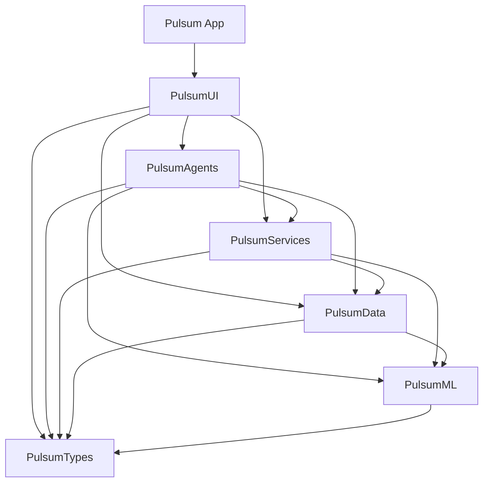

# Pulsum Codebase Baseline
Generated: 2025-11-11
Scope: All tracked files (269) read line-by-line.

## Table of Contents
- [Repo Inventory](#repo-inventory)
- [Build And Runtime Entry Points](#build-and-runtime-entry-points)
- [Architecture Overview](#architecture-overview)
- [Data And Persistence](#data-and-persistence)
- [HealthKit Pipeline](#healthkit-pipeline)
- [Time And Day Boundary Semantics](#time-and-day-boundary-semantics)
- [Wellbeing And Score Calculations](#wellbeing-and-score-calculations)
- [Micro Moments Content System](#micro-moments-content-system)
- [Embeddings And Vector Index](#embeddings-and-vector-index)
- [Recommendations Engine](#recommendations-engine)
- [UI Layer And State](#ui-layer-and-state)
- [Background Work And Scheduling](#background-work-and-scheduling)
- [Logging Diagnostics Privacy Security](#logging-diagnostics-privacy-security)
- [Testing And Quality](#testing-and-quality)
- [Known Issues And Risks](#known-issues-and-risks)
- [Appendix](#appendix)

## Repo Inventory
### Targets Modules Packages
- App target: `Pulsum` (SwiftUI app in `Pulsum/`), with `PulsumTests` and `PulsumUITests` in `Pulsum.xcodeproj/project.pbxproj`.
- Local SwiftPM packages: `PulsumTypes`, `PulsumML`, `PulsumData`, `PulsumServices`, `PulsumAgents`, `PulsumUI` (all in `Packages/`).

### Directory Map
- `.github/` CI workflows and repo config.
- `Packages/` local SwiftPM modules (Types, ML, Data, Services, Agents, UI) with sources and tests.
- `Pulsum/` app target sources, assets, entitlements, privacy manifest.
- `PulsumTests/` and `PulsumUITests/` Xcode test targets.
- `Docs/`, `ios support documents/`, `ios support files/` design and reference material (mostly PDFs).
- `scripts/` CI and guardrail scripts.
- Root markdown and analysis files (README, architecture, bugs, audits, etc).

### File Counts By Type
By extension:
- .swift: 155
- .md: 39
- .pdf: 18
- .json: 8
- .png: 8
- .sh: 7
- .xcprivacy: 6
- (no_ext): 4
- .yml: 3
- .mlmodel: 2
- .plist: 2
- .splineswift: 2
- .entitlements: 1
- .gif: 1
- .jpg: 1
- .mom: 1
- .omo: 1
- .pbxproj: 1
- .resolved: 1
- .template: 1
- .txt: 1
- .usdz: 1
- .xcscheme: 1
- .xcworkspacedata: 1
- .yaml: 1
- .zlist: 1

By role (approx):
- Swift sources: 155
- Tests: 68
- Markdown docs: 40
- Binary assets (pdf/png/jpg/gif/usdz/mom/omo/mlmodel/splineswift): 35
- Plist and privacy manifests: 8
- JSON data/config: 8
- Shell scripts: 7
- YAML config: 4
- Other or no extension: 12

### Large Files (>= 1,000,000 bytes)
- `main.gif` (20.80 MB)
- `Docs/a-practical-guide-to-building-with-gpt-5.pdf` (11.45 MB)
- `a-practical-guide-to-building-agents.pdf` (7.00 MB)
- `ios support documents/Landmarks_ Building an app with Liquid Glass _ Apple Developer Documentation.pdf` (6.97 MB)
- `codex_inventory.json` (4.85 MB)
- `ios support documents/Adopting Liquid Glass _ Apple Developer Documentation.pdf` (4.64 MB)
- `ios support documents/Liquid Glass _ Apple Developer Documentation.pdf` (4.08 MB)
- `coverage_ledger.json` (4.06 MB)
- `ChatGPT for engineers - Resource _ OpenAI Academy.pdf` (3.79 MB)
- `MAINDESIGN.png` (3.69 MB)
- `sha256.txt` (2.71 MB)
- `ios app mockup.png` (2.69 MB)
- `ios support documents/Landmarks_ Applying a background extension effect _ Apple Developer Documentation.pdf` (2.00 MB)
- `ios support documents/Landmarks_ Displaying custom activity badges _ Apple Developer Documentation.pdf` (1.79 MB)
- `files.zlist` (1.71 MB)
- `ios support documents/Landmarks_ Extending horizontal scrolling under a sidebar or inspector _ Apple Developer Documentation.pdf` (1.56 MB)
- `ios support documents/Landmarks_ Refining the system provided Liquid Glass effect in toolbars _ Apple Developer Documentation.pdf` (1.33 MB)
- `ios support documents/iOS & iPadOS 26 Release Notes _ Apple Developer Documentation.pdf` (1.15 MB)
- `ios support documents/Improving the safety of generative model output _ Apple Developer Documentation.pdf` (1.08 MB)
- `iconlogo.png` (1.03 MB)
- `Pulsum/Assets.xcassets/AppIcon.appiconset/iconnew 1.png` (0.96 MB)
- `Pulsum/Assets.xcassets/AppIcon.appiconset/iconnew 2.png` (0.96 MB)
- `Pulsum/Assets.xcassets/AppIcon.appiconset/iconnew.png` (0.96 MB)
- `iconnew.png` (0.96 MB)

## Build And Runtime Entry Points
### Xcodeproj And SwiftPM Layout
- Xcode project: `Pulsum.xcodeproj` with targets `Pulsum`, `PulsumTests`, `PulsumUITests` in `Pulsum.xcodeproj/project.pbxproj`.
- SwiftPM packages in `Packages/*/Package.swift` define local modules and tests, all set to iOS 26.0 (and macOS 14 where applicable).
- Workspace metadata: `Pulsum.xcodeproj/project.xcworkspace/contents.xcworkspacedata` and `Pulsum.xcodeproj/project.xcworkspace/xcshareddata/swiftpm/Package.resolved`.

### App Entry
- App entry point: `Pulsum/PulsumApp.swift` defines `@main` SwiftUI `PulsumApp` and hosts `PulsumRootView`.
- No `AppDelegate` or `SceneDelegate` is present; lifecycle is SwiftUI only.

### Startup Flow
- `PulsumRootView` instantiates `AppViewModel` and calls `start()` in `.task`.
- `AppViewModel.start()` creates `AgentOrchestrator` via `PulsumAgents.makeOrchestrator()` and binds view models (coach, pulse, settings), then calls `orchestrator.start()` and refreshes recommendations.
- If `PulsumData.backupSecurityIssue` is non-nil, startup blocks with an explicit UI message and does not proceed.

## Architecture Overview
### System Context
- Pulsum is a local-first iOS app that reads HealthKit data, captures voice journals via Speech, computes wellbeing scores on device, and optionally calls OpenAI Responses API for GPT-5 phrasing when user consent is granted.
- Foundation Models and Apple Intelligence are used opportunistically on iOS 26, with fallback behavior when unavailable.

### Containers
- iOS app container: SwiftUI app target (`Pulsum/`) plus local SwiftPM packages.
- Local packages: `PulsumTypes` (shared types and diagnostics), `PulsumML`, `PulsumData`, `PulsumServices`, `PulsumAgents`, `PulsumUI`.
- External systems: HealthKit, Speech framework, Foundation Models (Apple Intelligence), Keychain, OpenAI Responses API.

### Components (Core)
- UI: `PulsumRootView`, `AppViewModel`, `CoachViewModel`, `PulseViewModel`, `SettingsViewModel` in `Packages/PulsumUI/Sources/PulsumUI/`.
- Orchestration: `AgentOrchestrator` in `Packages/PulsumAgents/Sources/PulsumAgents/AgentOrchestrator.swift`.
- Data ingestion and scoring: `DataAgent` in `Packages/PulsumAgents/Sources/PulsumAgents/DataAgent.swift`.
- Journaling: `SentimentAgent` + `SpeechService` in `Packages/PulsumAgents/Sources/PulsumAgents/SentimentAgent.swift` and `Packages/PulsumServices/Sources/PulsumServices/SpeechService.swift`.
- Recommendations: `CoachAgent` + `RecRanker` + `VectorIndex` in `Packages/PulsumAgents/Sources/PulsumAgents/CoachAgent.swift` and `Packages/PulsumML/Sources/PulsumML/RecRanker.swift`.
- Safety and guardrails: `SafetyAgent` + `SafetyLocal` + `TopicGate` in `Packages/PulsumAgents/Sources/PulsumAgents/SafetyAgent.swift` and `Packages/PulsumML/Sources/PulsumML/SafetyLocal.swift`.
- Persistence: Core Data stack (`DataStack`) and file-backed state stores (Backfill, Estimator, RecRanker).

### Dependency Diagram (Packages)

## Data And Persistence
### Core Data Model
Source: `Packages/PulsumData/Sources/PulsumData/Resources/Pulsum.xcdatamodeld/Pulsum.xcdatamodel/contents`.
- `JournalEntry`: id (UUID), date (Date), transcript (String), sentiment (Double?), embeddedVectorURL (String?), sensitiveFlags (String?).
- `DailyMetrics`: date (Date), hrvMedian, nocturnalHRPercentile10, restingHR, totalSleepTime, sleepDebt, respiratoryRate, steps (all Double?), flags (String?).
- `Baseline`: metric (String), windowDays (Int16), median, mad, ewma (Double?), updatedAt (Date?).
- `FeatureVector`: date, zHrv, zNocturnalHR, zRestingHR, zSleepDebt, zRespiratoryRate, zSteps, subjectiveStress, subjectiveEnergy, subjectiveSleepQuality, sentiment (Double?), imputedFlags (String?).
- `MicroMoment`: id, title, shortDescription, detail, tags (Transformable, NSSecureUnarchiveFromData), estimatedTimeSec (Int32), difficulty, category, sourceURL, evidenceBadge, cooldownSec.
- `RecommendationEvent`: momentId, date, accepted (Bool), completedAt (Date?).
- `LibraryIngest`: id (UUID), source, checksum, ingestedAt, version.
- `UserPrefs`: id (String), consentCloud (Bool), updatedAt.
- `ConsentState`: id (UUID), version, grantedAt, revokedAt.
- No explicit relationships are defined in the model.

### DataStack Configuration
- `DataStack` in `Packages/PulsumData/Sources/PulsumData/DataStack.swift` uses `NSPersistentContainer` with:
  - SQLite store at `Application Support/Pulsum/Pulsum.sqlite`.
  - `NSFileProtectionComplete` on iOS, automatic migration, history tracking enabled.
  - Backup exclusion for Application Support, VectorIndex, and Anchors directories; `PulsumData.backupSecurityIssue` is set if exclusion fails.
- `PulsumData` facade in `Packages/PulsumData/Sources/PulsumData/PulsumData.swift` exposes container, viewContext, background contexts, and storage paths.

### Other Persistent State
- HealthKit anchors stored in `Application Support/Pulsum/Anchors` via `HealthKitAnchorStore` with file protection.
- Vector index shards stored in `Application Support/Pulsum/VectorIndex` with file protection.
- `BackfillStateStore`, `EstimatorStateStore`, and `RecRankerStateStore` persist JSON under Application Support with backup exclusion.
- Journal embeddings stored as `.vec` files in `VectorIndex/JournalEntries` with file protection.

## HealthKit Pipeline
### Permissions And Access
- `HealthKitService.requestAuthorization()` in `Packages/PulsumServices/Sources/PulsumServices/HealthKitService.swift` requests read access for:
  - HRV (HKQuantityTypeIdentifier.heartRateVariabilitySDNN)
  - Heart rate (HKQuantityTypeIdentifier.heartRate)
  - Resting heart rate (HKQuantityTypeIdentifier.restingHeartRate)
  - Respiratory rate (HKQuantityTypeIdentifier.respiratoryRate)
  - Step count (HKQuantityTypeIdentifier.stepCount)
  - Sleep analysis (HKCategoryTypeIdentifier.sleepAnalysis)
- `DataAgent.start()` always requests authorization to refresh state and then computes `HealthAccessStatus` via `requestStatusForAuthorization` and `probeReadAuthorization`.
- UI uses `HealthAccessRequirement` (in `Packages/PulsumUI/Sources/PulsumUI/HealthAccessRequirement.swift`) to map each type to labels and icons.
- Purpose strings for HealthKit, Microphone, and Speech are not present in tracked Info.plist files; they may be configured in Xcode build settings or untracked plist resources.

### Read Pipeline And Storage
- Observers: `DataAgent.configureObservation` enables background delivery and starts observer + anchored queries for each granted type (`HealthKitService.observeSampleType`).
- Anchors: `HealthKitAnchorStore` persists anchors per type in `Application Support/Pulsum/Anchors/*.anchor`.
- Updates: `DataAgent.handle(update:)` processes samples and deleted objects, updates `DailyMetrics` and `DailyFlags`, and reprocesses affected days.
- Storage: `DailyMetrics` stores computed metrics; raw-ish sample summaries are stored inside `DailyFlags` JSON (HRV samples, HR samples, sleep segments, step buckets, respiratory samples).

### Warm Start And Backfill
- Bootstrap: `DataAgent.bootstrapFirstScore` fetches last 2 days for each granted type with per-type hard timeouts and emits a first snapshot if possible.
- Placeholder: If bootstrap fails or times out, `ensurePlaceholderSnapshot` creates a zeroed FeatureVector with `snapshot_placeholder` flag so UI shows a warm-up state.
- Warm start: `backfillHistoricalSamplesIfNeeded` fetches 7-day window for all granted types, updates metrics, and notifies snapshots.
- Full backfill: `performBackgroundFullBackfill` runs in batches (5-day chunks) until 30-day window is covered; progress tracked in `BackfillProgress` persisted by `BackfillStateStore`.

## Time And Day Boundary Semantics
### Day Key Definition
- The canonical day key for data storage is `calendar.startOfDay(for: date)` where `calendar` is `Calendar(identifier: .gregorian)` (local time zone, system default).
- This day key is used for `DailyMetrics.date`, `FeatureVector.date`, and when grouping HealthKit samples by day.

### Day Computation Locations
- `DataAgent` uses `calendar.startOfDay(for:)` throughout ingestion, bootstrap, backfill, reprocess, and subjective inputs (`Packages/PulsumAgents/Sources/PulsumAgents/DataAgent.swift`).
- `SentimentAgent` writes sentiment into `FeatureVector` for the `startOfDay` of the journal timestamp.
- `HealthKitService` groups and bounds queries with `Calendar.startOfDay` in anchor windows and daily statistics (`Packages/PulsumServices/Sources/PulsumServices/HealthKitService.swift`).
- Diagnostics day strings use UTC via `DiagnosticsDayFormatter` (`Packages/PulsumTypes/Sources/PulsumTypes/DiagnosticsTypes.swift`).

### Mismatch Risks
- Day strings are formatted in UTC while day keys are computed in local time. This can produce off-by-one displays in logs and UI if the device is not in UTC.
- If the user changes time zones or crosses DST boundaries, `startOfDay` changes while stored dates remain anchored to old local midnights, which can create duplicate or missing day bins.
- `notifySnapshotUpdate` posts `AgentNotificationKeys.date` as "today" (startOfDay for current Date) even when reprocessing historical days, which can confuse consumers.

### Likely Midnight Reset Failure Modes
- `FeatureVector` and `DailyMetrics` are keyed by local midnight but `DiagnosticsDayFormatter` uses UTC, so the "day string" shown in UI can lag or lead the actual day.
- HealthKit anchored queries can deliver samples that straddle midnight; grouping by `startOfDay` in current time zone can put late-night samples into a different day after time zone changes.
- Imputation (carry-forward) can retain previous-day metrics when new samples are missing, giving the appearance that the score does not reset at midnight.

### Suggested Test Locations
- Day boundary and time zone changes around `DataAgent.dayRange`, `DataAgent.reprocessDayInternal`, and `DiagnosticsDayFormatter`.
- DST transitions for sample grouping (`DailyFlags.sleepSegments` and step buckets) and for `sleepDebtHours` windowing.

## Wellbeing And Score Calculations
### Input Sources
- HealthKit: HRV, nocturnal HR, resting HR, respiratory rate, steps, and sleep (via `DailyMetrics` and `DailyFlags`).
- Subjective sliders: stress, energy, sleepQuality (`PulseViewModel.submitInputs` -> `DataAgent.recordSubjectiveInputs`).
- Journal sentiment: `SentimentAgent.persistJournal` writes sentiment to the day `FeatureVector`.

### Calculation Pipeline
- `DataAgent.computeSummary` calculates daily metrics, with imputation when data is missing (e.g., carry-forward HRV/resting/nocturnal, missing steps flags).
- `updateBaselines` computes robust stats (median and MAD) for last N days and updates `Baseline` with EWMA.
- `buildFeatureBundle` converts raw values to z-scores (z_hrv, z_nocthr, z_resthr, z_sleepDebt, z_rr, z_steps), plus subjective and sentiment values.
- `WellbeingModeling.normalize` clamps values and attenuates imputed signals; `WellbeingModeling.target` computes a weighted target score.
- `StateEstimator.update` applies online learning and produces `wellbeingScore` and per-feature contributions; persisted to disk for future runs.

### Caching And Invalidation
- `FeatureVector` and `DailyMetrics` persist per-day values. They are only recomputed when new samples arrive or when subjective/journal inputs are saved.
- `StateEstimator` weights persist across sessions; they drift over time based on incoming data.
- `Baseline` values persist; they only update when reprocessing runs for a day inside the rolling window.

### Why Values Can Be Wrong Or Stale
- Imputation can carry forward metrics indefinitely when new samples are missing; values may appear unchanged across days.
- If HealthKit background delivery is not enabled or anchored queries stop, `reprocessDayInternal` is never called, leaving stale scores.
- Baseline windows can be skewed if older data remains and newer data is missing; EWMA uses last observed values.
- Day boundary mismatches (local day vs UTC string) can make it look like the score did not reset even if it did.

## Micro Moments Content System
### JSON Schema And Fields
- JSON files contain an array of episodes. Each episode has:
  - `episodeNumber` (String)
  - `episodeTitle` (String)
  - `recommendations` (array)
- Each recommendation includes:
  - `recommendation`, `shortDescription`, `detailedDescription` (String)
  - `microActivity` (String, optional)
  - `researchLink` (String, optional)
  - `difficultyLevel` (String, optional)
  - `timeToComplete` (String, optional)
  - `tags` (array of String, optional)
  - `category` (String, optional)
  - `cooldownSec` (Int, optional)
- Extra JSON fields (e.g., `timestamp`, `subcategory`) are ignored by the decoder in `LibraryImporter`.

### Import And Merge Strategy
- `LibraryImporter` discovers JSON resources in the app bundle (subdirectory "json database" by default, with fallback to root).
- SHA-256 checksum per file is stored in `LibraryIngest`; identical checksums are skipped for idempotency.
- Each recommendation becomes a `MicroMoment` entity. IDs are derived from `episodeNumber` and the recommendation string (slugified).
- `EvidenceScorer` assigns evidence badge based on the `researchLink` domain.
- `estimatedTimeSec` is parsed from `timeToComplete` string; `cooldownSec` stored when present.

### Update Tracking
- `LibraryIngest` tracks source filename, checksum, version, and timestamp.
- If embeddings are unavailable, indexing is deferred and checksum updates are skipped so retry can occur later.

## Embeddings And Vector Index
### Providers And Availability
- `EmbeddingService` probes availability using a constant string and caches the result (cooldown 1 hour).
- Providers (in order):
  - `AFMTextEmbeddingProvider` (uses `NLEmbedding` if Apple Intelligence is ready on iOS 26).
  - `CoreMLEmbeddingFallbackProvider` (uses `PulsumFallbackEmbedding.mlmodel`).
- Failure modes: Apple Intelligence not ready, missing Core ML model, zero vectors, or provider exceptions.
- Availability can be forced via `PULSUM_EMBEDDINGS_AVAILABLE` in DEBUG.

### Vector Index Storage
- `VectorIndex` stores shards in `Application Support/Pulsum/VectorIndex/micro_moments`.
- Shards are binary files with a header + append-only records; metadata stored as JSON `.meta` files.
- Deletions mark records as deleted but do not compact files.

### Journal Embeddings
- `SentimentAgent` writes journal embeddings to `Application Support/Pulsum/VectorIndex/JournalEntries/<UUID>.vec`.
- `JournalEntry.embeddedVectorURL` stores the filename; missing embeddings are marked as pending in `sensitiveFlags`.

### Rebuild Behavior
- There is no automatic rebuild or compaction. Rebuilds require deleting the vector index directory or re-ingesting.

## Recommendations Engine
### Candidate Generation And Ranking
- UI triggers `CoachViewModel.refreshRecommendations` which calls `AgentOrchestrator.recommendations`.
- `AgentOrchestrator.recommendations` fetches a `FeatureVectorSnapshot` with a hard timeout (2s); if missing or placeholder, returns no-data state.
- `CoachAgent.recommendationCards`:
  - Builds a query string from wellbeing score and top contributions.
  - Searches `VectorIndexManager` (topK 20).
  - Fetches `MicroMoment` entities and builds card candidates.
  - Ranks candidates using `RecRanker` and returns top 3.

### Fallbacks And Empty Results
- Embeddings unavailable -> `libraryEmbeddingsDeferred` set -> fallback to keyword search on title/tags.
- No vector matches -> fallback to keyword search.
- Keyword fallback uses in-memory filtering (tags are Transformable) and can still return empty.
- Any of the following yields empty recommendations:
  - No snapshot or placeholder snapshot.
  - Recommendation timeout (30s) in `AgentOrchestrator`.
  - Library resources missing (no MicroMoment data).
  - Embeddings unavailable and keyword fallback finds no matches.
  - Candidate filtering removes all cards (missing title/description).

### UI Gating
- `CoachView` shows:
  - Consent banner when cloud processing is off.
  - "Enhanced AI" banner when Apple Intelligence is not ready.
  - "Gathering more context" bubble when recommendation list is empty and not loading.
  - Soft timeout message after 9s if recommendations are still pending.
- `CoachAgent.recommendationNotice` propagates to UI as `cardErrorMessage` when embeddings are deferred.

### Keyword And Rule-Based Fallback
- Keyword fallback exists (`keywordBackfillMoments`), scanning title and tags in Core Data.
- No other rule-based or static recommendation list is implemented.

## UI Layer And State
### View Models And Navigation
- `PulsumRootView` defines the tab shell, sheets (pulse and settings), and safety overlays.
- `AppViewModel` handles startup state, orchestrator creation, consent storage, and notification-driven refreshes.
- `CoachViewModel` handles wellbeing snapshot state, recommendation refresh (debounced/coalesced), chat, and errors.
- `PulseViewModel` handles voice journaling (streaming), sentiment display, subjective sliders, and safety callbacks.
- `SettingsViewModel` handles HealthKit authorization UI, GPT-5 key storage/testing, and diagnostics export.

### Async Updates
- Async streams from `SpeechService` update waveform levels and transcripts in `PulseViewModel`.
- `NotificationCenter` `.pulsumScoresUpdated` triggers a refresh of recommendations in `AppViewModel`.
- Multiple concurrent refreshes are coalesced in `CoachViewModel` to prevent UI churn.

## Background Work And Scheduling
- Background delivery: `HealthKitService.enableBackgroundDelivery` requests immediate background delivery per type. This is best-effort and system-controlled.
- Observers: HKObserverQuery + HKAnchoredObjectQuery pairs deliver updates; DataAgent processes them as they arrive.
- Backfill: full backfill runs in a detached task; it does not use BGTaskScheduler and stops if the app is suspended.
- There are no other scheduled background tasks or timers beyond local `Task` usage and observer callbacks.

## Logging Diagnostics Privacy Security
### Logging And Diagnostics
- `Diagnostics` provides structured events, spans, stall monitors, and optional persistence to disk (`Packages/PulsumTypes/Sources/PulsumTypes/DiagnosticsLogger.swift`).
- `DebugLogBuffer` stores recent logs in memory; `DiagnosticsReportBuilder` exports a report for support.
- Many subsystems log to Diagnostics categories: healthkit, backfill, embeddings, sentiment, coach, llm, speech, safety, persistence.

### Privacy And Redaction
- `PIIRedactor` removes emails, phone numbers, and personal names before sentiment analysis and LLM requests.
- `LLMGateway` uses `MinimizedCloudRequest` and schema guarding to prevent sending transcripts or raw health data.
- `SpeechLoggingPolicy` disables transcript logging outside DEBUG.
- Privacy manifests exist for the app and all five packages (`PrivacyInfo.xcprivacy`).

### File Protection And Backups
- Core Data store and all on-device PHI directories use `NSFileProtectionComplete`.
- Vector index, anchors, and state stores are excluded from iCloud backups.
- `BackupSecurityIssue` blocks startup if backup exclusions fail.
- App entitlements in `Pulsum/Pulsum.entitlements` enable HealthKit and HealthKit background delivery.

## Testing And Quality
### Test Targets
- App tests: `PulsumTests` (empty scaffold) and `PulsumUITests` (UI flows).
- Package tests: `PulsumTypesTests`, `PulsumMLTests`, `PulsumDataTests`, `PulsumServicesTests`, `PulsumAgentsTests`, `PulsumUITests` (SwiftPM).

### Coverage Summary By Area
- HealthKit pipeline: `Gate6_WellbeingBackfillPhasingTests`, `HealthKitAnchorStoreTests`, HealthKit stubs.
- Embeddings and topic gating: `EmbeddingServiceAvailabilityTests`, `Gate6_EmbeddingProviderContextualTests`, `TopicGateTests`.
- Recommendation ranking: `Gate6_RecRankerLearningTests`, `Gate6_RecRankerPersistenceTests`.
- LLM gateway and schema: `LLMGatewayTests`, `Gate0_LLMGatewayTests`, schema validation tests.
- Speech and journaling: Speech service authorization tests, journal session tests, fake backend tests.
- UI: `CoachViewModelTests`, `PulsumRootViewTests`, several UI tests for first-run and settings.

### Gaps And Missing Tests
- No automated tests for day boundary behavior across time zone or DST changes.
- No test asserts midnight reset (new day snapshot creation and UI update).
- No test ensures recommendations are non-empty when library resources are missing or empty.
- No end-to-end test validates embedding availability fallback across LibraryImporter, VectorIndex, and recommendations.
- No test covers vector index rebuild/compaction or metadata corruption recovery.
- `PulsumTests/PulsumTests.swift` is empty and provides no app unit coverage.

## Known Issues And Risks
Top 10 risks grounded in code paths:
1. Day boundary mismatch between local `startOfDay` and UTC `DiagnosticsDayFormatter` can cause apparent midnight reset issues (DataAgent and Diagnostics day formatting mismatch).
2. Embedding availability caching can defer indexing and journaling embeddings for up to 1 hour; deferred library import leads to limited or empty recommendations.
3. Modern speech backend is a stub and routes to the legacy backend, so iOS 26 speech APIs are not in use (`SpeechService.ModernSpeechBackend`).
4. Library importer expects bundle JSON under "json database"; missing resources lead to zero MicroMoments and empty recommendations.
5. Vector index has no compaction or rebuild; deleted entries stay on disk and corruption is not auto-repaired.
6. Full backfill runs in detached tasks without BGTaskScheduler; it can stop when the app is suspended, leaving incomplete data windows.
7. StateEstimator weights persist and can drift due to partial data, potentially skewing wellbeing scores across sessions.
8. Imputation carries forward prior-day metrics (HRV, nocturnal HR, resting HR), masking missing data and making scores appear stale.
9. Notification `.pulsumScoresUpdated` always uses "today" in userInfo, even for historical reprocess, which can mislead UI consumers.
10. Keyword fallback for recommendations relies on tags/title only; if tags are empty or sparse, recommendations can return empty even with data.

## Appendix
### File Index
(The appendix includes all tracked files. Binary files list path, size, type guess, and read failure reason.)
- `.github/coderabbit.yaml`: YAML configuration (likely CI workflow or settings).
- `.github/workflows/auto-merge.yml`: YAML configuration (likely CI workflow or settings).
- `.github/workflows/auto-pr.yml`: YAML configuration (likely CI workflow or settings).
- `.github/workflows/test-harness.yml`: YAML configuration (likely CI workflow or settings).
- `.gitignore`: Git ignore rules.
- `CLAUDE.md`: Markdown documentation. First heading: CLAUDE.md.
- `COMPREHENSIVE_BUG_ANALYSIS.md`: Markdown documentation. First heading: PULSUM iOS App - Comprehensive Architectural Bug Analysis.
- `ChatGPT for engineers - Resource _ OpenAI Academy.pdf`: Binary file (type: application/pdf, size: 3977697 bytes). Not readable as text: contains NUL bytes.
- `Config.xcconfig.template`: Text file (Config.xcconfig.template).
- `Docs/a-practical-guide-to-building-with-gpt-5.pdf`: Binary file (type: application/pdf, size: 12010712 bytes). Not readable as text: contains NUL bytes.
- `Docs/architecture copy.md`: Markdown documentation. First heading: Pulsum - Complete Architecture Documentation.
- `Docs/architecture_short copy.md`: Markdown documentation. First heading: Pulsum - Architecture Documentation (Condensed).
- `Docs/chat1.md`: Markdown documentation. First heading: Pulsum Project – Progress Summary (Chat Session).
- `Docs/chat2.md`: Markdown documentation. First heading: Pulsum Project – Continuation Log (Chat 2).
- `GITHUB_WORKFLOW.md`: Markdown documentation. First heading: GitHub Workflow Guide for Pulsum.
- `MAINDESIGN.png`: Binary file (type: image/png, size: 3873254 bytes). Not readable as text: contains NUL bytes.
- `Packages/PulsumAgents/Package.swift`: Swift source. Types: no top-level types. Functions: no top-level functions.
- `Packages/PulsumAgents/Sources/PulsumAgents/AgentOrchestrator.swift`: Swift source. Types: OrchestratorStartupError, TopicSignalResolver, TopicFocus, DataAgentProviding, DataAgent, SentimentAgentProviding. Functions: mapTopicToSignalOrDataDominant, dataDominantSignal, start, setDiagnosticsTraceId, latestFeatureVector, recordSubjectiveInputs.
- `Packages/PulsumAgents/Sources/PulsumAgents/BackfillStateStore.swift`: Swift source. Types: BackfillStateStoring, SendableFileManager, BackfillProgress, BackfillStateStore. Functions: loadState, saveState, earliestProcessedDate, minDate, logError, prepareDirectory.
- `Packages/PulsumAgents/Sources/PulsumAgents/CheerAgent.swift`: Swift source. Types: CheerAgent. Functions: celebrateCompletion.
- `Packages/PulsumAgents/Sources/PulsumAgents/CoachAgent+Coverage.swift`: Swift source. Types: CoveragePassKind, CoverageDecision, CoverageInputs. Functions: simFromL2, median, decideCoverage, logCoverage.
- `Packages/PulsumAgents/Sources/PulsumAgents/CoachAgent.swift`: Swift source. Types: CoachAgent, CardCandidate. Functions: prepareLibraryIfNeeded, retryDeferredLibraryImport, recommendationCards, chatResponse, mapIntentToSignal, logEvent.
- `Packages/PulsumAgents/Sources/PulsumAgents/DataAgent.swift`: Swift source. Types: FeatureVectorSnapshot, ScoreBreakdown, MetricDetail, Kind, Coverage, SnapshotPlaceholder. Functions: isPlaceholder, setDiagnosticsTraceId, start, startIngestionIfAuthorized, restartIngestionAfterPermissionsChange, requestHealthAccess.
- `Packages/PulsumAgents/Sources/PulsumAgents/EstimatorStateStore.swift`: Swift source. Types: EstimatorStateStoring, EstimatorStateStore. Functions: loadState, saveState, logError, prepareDirectory, applyFileProtection, excludeFromBackup.
- `Packages/PulsumAgents/Sources/PulsumAgents/HealthAccessStatus.swift`: Swift source. Types: HealthAccessStatus, Availability. Functions: no top-level functions.
- `Packages/PulsumAgents/Sources/PulsumAgents/PrivacyInfo.xcprivacy`: Apple privacy manifest (plist XML).
- `Packages/PulsumAgents/Sources/PulsumAgents/PulsumAgents.swift`: Swift source. Types: PulsumAgents. Functions: makeOrchestrator, healthCheck, foundationModelsStatus.
- `Packages/PulsumAgents/Sources/PulsumAgents/RecRankerStateStore.swift`: Swift source. Types: RecRankerStateStoring, RecRankerStateStore. Functions: loadState, saveState, logError, prepareDirectory, applyFileProtection, excludeFromBackup.
- `Packages/PulsumAgents/Sources/PulsumAgents/SafetyAgent.swift`: Swift source. Types: SafetyAgent. Functions: evaluate, makeDecision.
- `Packages/PulsumAgents/Sources/PulsumAgents/SentimentAgent.swift`: Swift source. Types: SentimentAgentError, SentimentAgent, JournalSessionState. Functions: requestAuthorization, beginVoiceJournal, updateTranscript, finishVoiceJournal, recordVoiceJournal, stopRecording.
- `Packages/PulsumAgents/Sources/PulsumAgents/WellbeingScoreState.swift`: Swift source. Types: WellbeingNoDataReason, WellbeingScoreState. Functions: no top-level functions.
- `Packages/PulsumAgents/Tests/PulsumAgentsTests/AgentSystemTests.swift`: Swift source. Types: AgentSystemTests. Functions: testFoundationModelsAvailability, testSafetyAgentFlagsCrisis, testAgentOrchestrationFlow, testPIIRedactionInSentimentPipeline, makeInMemoryContainer.
- `Packages/PulsumAgents/Tests/PulsumAgentsTests/ChatGuardrailAcceptanceTests.swift`: Swift source. Types: ChatGuardrailAcceptanceTests, ChatHarness, StubDataAgent, StubVectorIndex, AcceptanceCloudClient, AcceptanceLocalGenerator. Functions: greetingRoutesOnDevice, sleepQuestionRoutesToCloud, sleepQuestionRoutesOnDeviceWhenConsentOff, motivationPromptOnTopic, primeFactorsRedirects, reset.
- `Packages/PulsumAgents/Tests/PulsumAgentsTests/ChatGuardrailTests.swift`: Swift source. Types: ChatGuardrailTests, CountingCloudClient, CountingLocalGenerator, KeywordTopicGate. Functions: offTopicBlocked, onTopicPasses, crisisContentBlocked, coverageThresholdEnforced, redirectMessageConsistent, coverageStrongPass.
- `Packages/PulsumAgents/Tests/PulsumAgentsTests/DebugLogBufferTests.swift`: Swift source. Types: DebugLogBufferTests. Functions: testRingBufferEvictsOldEntries.
- `Packages/PulsumAgents/Tests/PulsumAgentsTests/Gate2_JournalSessionTests.swift`: Swift source. Types: Gate2_JournalSessionTests. Functions: testBeginRejectsDuplicateSessions, testTakeSessionClearsState, makeSession.
- `Packages/PulsumAgents/Tests/PulsumAgentsTests/Gate2_OrchestratorLLMKeyAPITests.swift`: Swift source. Types: Gate2_OrchestratorLLMKeyAPITests, DataAgentStub, SentimentAgentStub, TopicGateStub, InMemoryKeychain, StubURLProtocol. Functions: testLLMKeyRoundTripAndConnectivity, makeOrchestrator, makeCoachAgent, setDiagnosticsTraceId, start, latestFeatureVector.
- `Packages/PulsumAgents/Tests/PulsumAgentsTests/Gate2_TypesWiringTests.swift`: Swift source. Types: Gate2_TypesWiringTests. Functions: testSpeechSegmentInit.
- `Packages/PulsumAgents/Tests/PulsumAgentsTests/Gate3_FreshnessBusTests.swift`: Swift source. Types: Gate3_FreshnessBusTests, PostedNotification, RecordingNotificationCenter. Functions: testReprocessDayPostsSingleNotification, testDebouncedNotificationsCoalesceBursts, notifications.
- `Packages/PulsumAgents/Tests/PulsumAgentsTests/Gate3_HealthAccessStatusTests.swift`: Swift source. Types: Gate3_HealthAccessStatusTests. Functions: testDeniedTypesAreExcludedFromObservation, testReadOnlyAuthorizationDoesNotMarkGrantedAsDenied, testMixedProbeResultsClassifyPerType.
- `Packages/PulsumAgents/Tests/PulsumAgentsTests/Gate3_IngestionIdempotenceTests.swift`: Swift source. Types: Gate3_IngestionIdempotenceTests. Functions: testRestartDoesNotDuplicateObserversAndStopsRevokedTypes.
- `Packages/PulsumAgents/Tests/PulsumAgentsTests/Gate4_ConsentRoutingTests.swift`: Swift source. Types: Gate4_ConsentRoutingTests, ConsentCloudClientStub, ConsentLocalGeneratorStub. Functions: consentOffFallsBackLocal, consentOnUsesCloud, generateResponse, generate.
- `Packages/PulsumAgents/Tests/PulsumAgentsTests/Gate4_LLMKeyTests.swift`: Swift source. Types: Gate4_LLMKeyTests, EphemeralKeychain. Functions: testSetAndGetKeyRoundtripUsesKeychainStub, testPingAcceptsExpectedVariants, setSecret, secret, removeSecret.
- `Packages/PulsumAgents/Tests/PulsumAgentsTests/Gate4_RoutingTests.swift`: Swift source. Types: Gate4_RoutingTests, NSManagedObjectContext, RoutingVectorIndexStub. Functions: fallbackUsesMaximumMagnitude, fallbackIgnoresUnknownKeys, topicOverrideDeterministic, candidateMomentsHandleNilDetail, makeSnapshot, upsertMicroMoment.
- `Packages/PulsumAgents/Tests/PulsumAgentsTests/Gate6_EmbeddingAvailabilityDegradationTests.swift`: Swift source. Types: Gate6_EmbeddingAvailabilityDegradationTests, UnavailableIndexStub. Functions: testRecommendationsFallbackWhenEmbeddingsUnavailable, upsertMicroMoment, removeMicroMoment, searchMicroMoments.
- `Packages/PulsumAgents/Tests/PulsumAgentsTests/Gate6_RecRankerLearningTests.swift`: Swift source. Types: Gate6_RecRankerLearningTests, Gate6VectorIndexStub. Functions: testCoachAgentAppliesFeedbackToRanking, upsertMicroMoment, removeMicroMoment, searchMicroMoments.
- `Packages/PulsumAgents/Tests/PulsumAgentsTests/Gate6_RecRankerPersistenceTests.swift`: Swift source. Types: Gate6_RecRankerPersistenceTests, VectorIndexStub. Functions: testRankerStatePersistsAcrossAgentRestarts, makeCoachAgent, upsertMicroMoment, removeMicroMoment, searchMicroMoments.
- `Packages/PulsumAgents/Tests/PulsumAgentsTests/Gate6_SentimentJournalingFallbackTests.swift`: Swift source. Types: Gate6_SentimentJournalingFallbackTests, AlwaysFailEmbeddingProvider, StubSentimentProvider. Functions: testJournalPersistsWhenEmbeddingUnavailable, embedding, sentimentScore.
- `Packages/PulsumAgents/Tests/PulsumAgentsTests/Gate6_StateEstimatorPersistenceTests.swift`: Swift source. Types: Gate6_StateEstimatorPersistenceTests. Functions: testEstimatorStatePersistsAcrossInstances.
- `Packages/PulsumAgents/Tests/PulsumAgentsTests/Gate6_StateEstimatorWeightsAndLabelsTests.swift`: Swift source. Types: Gate6_StateEstimatorWeightsAndLabelsTests. Functions: testRecoverySignalsLiftScore, testImputedSignalsClampToNeutralContribution.
- `Packages/PulsumAgents/Tests/PulsumAgentsTests/Gate6_WellbeingBackfillPhasingTests.swift`: Swift source. Types: Gate6_WellbeingBackfillPhasingTests, BackfillStateStoreSpy, TestDailyFlags, TestSleepSegment. Functions: testWarmStartBackfillsFastWindowAndProducesSnapshot, testAggregatedStepsAndNocturnalHRUseStatisticsQueries, testRequestHealthAccessReturnsBeforeWarmStartCompletes, testBackgroundBackfillExpandsCoverageAndPersistsAcrossSessions, testBootstrapFallbackFindsOlderDataWhenRecentWindowIsEmpty, testSleepDebtMissingDataIsImputedButScoreStillComputes.
- `Packages/PulsumAgents/Tests/PulsumAgentsTests/Gate6_WellbeingStateMappingTests.swift`: Swift source. Types: Gate6_WellbeingStateMappingTests. Functions: testComputeWellbeingStateMatchesHealthAccess.
- `Packages/PulsumAgents/Tests/PulsumAgentsTests/HealthKitServiceStub.swift`: Swift source. Types: HealthKitServiceStub, StubObservationToken. Functions: requestAuthorization, requestStatusForAuthorization, probeReadAuthorization, fetchDailyStepTotals, fetchNocturnalHeartRateStats, fetchSamples.
- `Packages/PulsumAgents/Tests/PulsumAgentsTests/TestCoreDataStack.swift`: Swift source. Types: TestCoreDataStack. Functions: makeContainer.
- `Packages/PulsumData/Package.swift`: Swift source. Types: no top-level types. Functions: no top-level functions.
- `Packages/PulsumData/Sources/PulsumData/Bundle+PulsumDataResources.swift`: Swift source. Types: Bundle, PulsumDataBundleLocator. Functions: no top-level functions.
- `Packages/PulsumData/Sources/PulsumData/DataStack.swift`: Swift source. Types: PulsumDataError, BackupSecurityIssue, StoragePaths, DataStack. Functions: newBackgroundContext, performBackgroundTask, prepareDirectories, applyBackupExclusion, debugApplyBackupExclusion, loadManagedObjectModel.
- `Packages/PulsumData/Sources/PulsumData/EvidenceScorer.swift`: Swift source. Types: EvidenceBadge, EvidenceScorer. Functions: badge.
- `Packages/PulsumData/Sources/PulsumData/LibraryImporter.swift`: Swift source. Types: LibraryImporterConfiguration, LibraryImporterError, LibraryImporter, LibraryResourcePayload, MicroMomentIndexPayload, LibraryIngestUpdate. Functions: ingestIfNeeded, process, upsertMicroMoment, recommendationIdentifier, parseTimeInterval, extractLeadingNumber.
- `Packages/PulsumData/Sources/PulsumData/Model/ManagedObjects.swift`: Swift source. Types: JournalEntry, DailyMetrics, Baseline, FeatureVector, MicroMoment, RecommendationEvent. Functions: no top-level functions.
- `Packages/PulsumData/Sources/PulsumData/PrivacyInfo.xcprivacy`: Apple privacy manifest (plist XML).
- `Packages/PulsumData/Sources/PulsumData/PulsumData.swift`: Swift source. Types: PulsumData. Functions: newBackgroundContext, performBackgroundTask.
- `Packages/PulsumData/Sources/PulsumData/PulsumManagedObjectModel.swift`: Swift source. Types: PulsumManagedObjectModel. Functions: no top-level functions.
- `Packages/PulsumData/Sources/PulsumData/Resources/Pulsum.xcdatamodeld/.xccurrentversion`: Text file (.xccurrentversion).
- `Packages/PulsumData/Sources/PulsumData/Resources/Pulsum.xcdatamodeld/Pulsum.xcdatamodel/contents`: Text file (contents).
- `Packages/PulsumData/Sources/PulsumData/Resources/PulsumCompiled.momd/Pulsum.mom`: Binary file (type: mom, size: 8979 bytes). Not readable as text: contains NUL bytes.
- `Packages/PulsumData/Sources/PulsumData/Resources/PulsumCompiled.momd/Pulsum.omo`: Binary file (type: omo, size: 22072 bytes). Not readable as text: contains NUL bytes.
- `Packages/PulsumData/Sources/PulsumData/Resources/PulsumCompiled.momd/VersionInfo.plist`: Binary file (type: plist, size: 743 bytes). Not readable as text: contains NUL bytes.
- `Packages/PulsumData/Sources/PulsumData/VectorIndex.swift`: Swift source. Types: VectorIndexFileHandle, FileHandle, VectorIndexFileHandleFactory, SystemVectorIndexFileHandleFactory, VectorMatch, VectorIndexError. Functions: seekToEnd, seek, read, write, close, updatingHandle.
- `Packages/PulsumData/Sources/PulsumData/VectorIndexManager.swift`: Swift source. Types: VectorIndexProviding, VectorIndexManager. Functions: upsertMicroMoment, removeMicroMoment, searchMicroMoments, stats.
- `Packages/PulsumData/Tests/PulsumDataTests/DataStackSecurityTests.swift`: Swift source. Types: DataStackSecurityTests. Functions: testDebugApplyBackupExclusionMarksDirectories.
- `Packages/PulsumData/Tests/PulsumDataTests/Gate0_DataStackSecurityTests.swift`: Swift source. Types: Gate0_DataStackSecurityTests. Functions: testPHIDirectoriesAreExcludedFromBackup.
- `Packages/PulsumData/Tests/PulsumDataTests/Gate5_LibraryImporterAtomicityTests.swift`: Swift source. Types: Gate5_LibraryImporterAtomicityTests, FlakyIndex, SpyIndex, UnavailableEmbeddingIndex, TestError, SampleEpisode. Functions: testChecksumNotSavedOnIndexFailure_andRetrySucceeds, testImporterIsIdempotent_NoDuplicateEpisodesAfterRetry, testSkipWhenChecksumMatches_DoesNotTouchIndex, testEmbeddingsUnavailableDefersIndexingGracefully, resetStore, fetchLibraryIngest.
- `Packages/PulsumData/Tests/PulsumDataTests/Gate5_LibraryImporterPerfTests.swift`: Swift source. Types: Gate5_LibraryImporterPerfTests. Functions: testCoreDataReadCompletesQuicklyDuringImport.
- `Packages/PulsumData/Tests/PulsumDataTests/Gate5_VectorIndexConcurrencyTests.swift`: Swift source. Types: Gate5_VectorIndexConcurrencyTests. Functions: testConcurrentShardOperationsRemainDeterministic, makeVector.
- `Packages/PulsumData/Tests/PulsumDataTests/Gate5_VectorIndexFileHandleTests.swift`: Swift source. Types: Gate5_VectorIndexFileHandleTests, TestHandleFactory, TestVectorHandle, CloseError. Functions: testCloseFailureIsSurfacedToCaller, updatingHandle, seekToEnd, seek, read, write.
- `Packages/PulsumData/Tests/PulsumDataTests/Gate5_VectorIndexManagerActorTests.swift`: Swift source. Types: Gate5_VectorIndexManagerActorTests, MockEmbeddingProvider. Functions: testManagerAllowsConcurrentAccessFromBackgroundTasks, embedding.
- `Packages/PulsumData/Tests/PulsumDataTests/LibraryImporterTests.swift`: Swift source. Types: HappyPathIndexStub, LibraryImporterTests. Functions: upsertMicroMoment, removeMicroMoment, searchMicroMoments, testIngestCreatesMicroMomentsAndVectorIndex.
- `Packages/PulsumData/Tests/PulsumDataTests/PulsumDataBootstrapTests.swift`: Swift source. Types: PulsumDataBootstrapTests. Functions: testPersistentContainerLoadsPulsumModel, testBackgroundContextCreation, testVectorIndexDirectoryIsInsideApplicationSupport, testHealthAnchorsDirectoryIsInsideApplicationSupport.
- `Packages/PulsumData/Tests/PulsumDataTests/Resources/podcasts_sample.json`: JSON data/config file (podcasts_sample.json).
- `Packages/PulsumData/Tests/PulsumDataTests/VectorIndexTests.swift`: Swift source. Types: VectorIndexTests. Functions: testUpsertAndSearch.
- `Packages/PulsumML/Package.swift`: Swift source. Types: no top-level types. Functions: no top-level functions.
- `Packages/PulsumML/Sources/PulsumML/AFM/FoundationModelsAvailability.swift`: Swift source. Types: AFMStatus, FoundationModelsAvailability. Functions: checkAvailability, availabilityMessage.
- `Packages/PulsumML/Sources/PulsumML/AFM/FoundationModelsStub.swift`: Swift source. Types: SystemLanguageModel, LanguageModelSession, GenerationError, Instructions, Prompt, GenerationOptions. Functions: respond.
- `Packages/PulsumML/Sources/PulsumML/AFM/README_FoundationModels.md`: Markdown documentation. First heading: Foundation Models Integration - iOS 26 Ready.
- `Packages/PulsumML/Sources/PulsumML/BaselineMath.swift`: Swift source. Types: BaselineMath, RobustStats. Functions: robustStats, zScore, ewma, percentile.
- `Packages/PulsumML/Sources/PulsumML/Bundle+PulsumMLResources.swift`: Swift source. Types: Bundle, PulsumMLBundleToken. Functions: no top-level functions.
- `Packages/PulsumML/Sources/PulsumML/Embedding/AFMTextEmbeddingProvider.swift`: Swift source. Types: AFMTextEmbeddingProvider. Functions: embedding, adjustDimension.
- `Packages/PulsumML/Sources/PulsumML/Embedding/CoreMLEmbeddingFallbackProvider.swift`: Swift source. Types: CoreMLEmbeddingFallbackProvider. Functions: embedding, adjustDimension.
- `Packages/PulsumML/Sources/PulsumML/Embedding/EmbeddingError.swift`: Swift source. Types: EmbeddingError. Functions: no top-level functions.
- `Packages/PulsumML/Sources/PulsumML/Embedding/EmbeddingService.swift`: Swift source. Types: EmbeddingService, AvailabilityMode, AvailabilityState. Functions: isAvailable, invalidateAvailabilityCache, refreshAvailability, availabilityMode, embedding, validated.
- `Packages/PulsumML/Sources/PulsumML/Embedding/TextEmbeddingProviding.swift`: Swift source. Types: TextEmbeddingProviding. Functions: embedding.
- `Packages/PulsumML/Sources/PulsumML/Placeholder.swift`: Swift source. Types: PulsumML. Functions: embedding.
- `Packages/PulsumML/Sources/PulsumML/PrivacyInfo.xcprivacy`: Apple privacy manifest (plist XML).
- `Packages/PulsumML/Sources/PulsumML/RecRanker.swift`: Swift source. Types: RecommendationFeatures, AcceptanceHistory, UserFeedback, RankerMetrics, RecRankerState, RecRanker. Functions: score, rank, update, updateLearningRate, adaptWeights, getPerformanceMetrics.
- `Packages/PulsumML/Sources/PulsumML/Resources/PulsumFallbackEmbedding.mlmodel`: Binary file (type: mlmodel, size: 410814 bytes). Not readable as text: contains NUL bytes.
- `Packages/PulsumML/Sources/PulsumML/Resources/PulsumSentimentCoreML.mlmodel`: Binary file (type: mlmodel, size: 5491 bytes). Not readable as text: contains NUL bytes.
- `Packages/PulsumML/Sources/PulsumML/Resources/README_CreateModel.md`: Markdown documentation. First heading: Creating Core ML Sentiment Model.
- `Packages/PulsumML/Sources/PulsumML/Safety/FoundationModelsSafetyProvider.swift`: Swift source. Types: FoundationModelsSafetyProvider, SafetyError. Functions: classify.
- `Packages/PulsumML/Sources/PulsumML/SafetyLocal.swift`: Swift source. Types: SafetyClassification, SafetyLocalConfig, SafetyLocal, Label, Prototype. Functions: classify, makePrototypes, refreshPrototypesIfNeeded, containsKeyword, fallbackClassification, cosineSimilarity.
- `Packages/PulsumML/Sources/PulsumML/Sentiment/AFMSentimentProvider.swift`: Swift source. Types: AFMSentimentProvider. Functions: sentimentScore, averageSimilarity, cosineSimilarity.
- `Packages/PulsumML/Sources/PulsumML/Sentiment/CoreMLSentimentProvider.swift`: Swift source. Types: CoreMLSentimentProvider. Functions: sentimentScore.
- `Packages/PulsumML/Sources/PulsumML/Sentiment/FoundationModelsSentimentProvider.swift`: Swift source. Types: FoundationModelsSentimentProvider. Functions: sentimentScore.
- `Packages/PulsumML/Sources/PulsumML/Sentiment/NaturalLanguageSentimentProvider.swift`: Swift source. Types: NaturalLanguageSentimentProvider. Functions: sentimentScore.
- `Packages/PulsumML/Sources/PulsumML/Sentiment/PIIRedactor.swift`: Swift source. Types: PIIRedactor. Functions: redact.
- `Packages/PulsumML/Sources/PulsumML/Sentiment/SentimentProviding.swift`: Swift source. Types: SentimentProviding, SentimentProviderError. Functions: sentimentScore.
- `Packages/PulsumML/Sources/PulsumML/Sentiment/SentimentService.swift`: Swift source. Types: SentimentService. Functions: sentiment.
- `Packages/PulsumML/Sources/PulsumML/StateEstimator.swift`: Swift source. Types: StateEstimatorConfig, StateEstimatorSnapshot, StateEstimatorState, StateEstimator. Functions: predict, update, currentSnapshot, persistedState, contributionVector.
- `Packages/PulsumML/Sources/PulsumML/TopicGate/EmbeddingTopicGateProvider.swift`: Swift source. Types: EmbeddingTopicGateProvider, WellbeingPrototype. Functions: classify, debugScores, cosineSimilarity, computeDecision, computeOODScore.
- `Packages/PulsumML/Sources/PulsumML/TopicGate/FoundationModelsTopicGateProvider.swift`: Swift source. Types: OnTopic, FoundationModelsTopicGateProvider, TopicGateError. Functions: classify.
- `Packages/PulsumML/Sources/PulsumML/TopicGate/TopicGateProviding.swift`: Swift source. Types: GateDecision, TopicGateProviding. Functions: classify.
- `Packages/PulsumML/Tests/PulsumMLTests/EmbeddingServiceAvailabilityTests.swift`: Swift source. Types: EmbeddingServiceAvailabilityTests, MutableEmbeddingProvider, StubClock. Functions: testReprobesAfterCooldown, testAvailabilityStaysTrueAfterSuccess, embedding, advance.
- `Packages/PulsumML/Tests/PulsumMLTests/EmbeddingServiceFallbackTests.swift`: Swift source. Types: EmbeddingServiceFallbackTests, FailingEmbeddingProvider, MockEmbeddingProvider. Functions: testFallsBackWhenPrimaryUnavailable, embedding.
- `Packages/PulsumML/Tests/PulsumMLTests/Gate0_EmbeddingServiceFallbackTests.swift`: Swift source. Types: MockEmbeddingProvider, Mode, MockError, Gate0_EmbeddingServiceFallbackTests. Functions: embedding, testFallsBackWhenPrimaryUnavailable, testAvailabilityProbeUsesFallback.
- `Packages/PulsumML/Tests/PulsumMLTests/Gate6_EmbeddingProviderContextualTests.swift`: Swift source. Types: Gate6_EmbeddingProviderContextualTests, ZeroEmbeddingProvider, ThrowingEmbeddingProvider, ConstantEmbeddingProvider. Functions: testEmbeddingServiceRejectsZeroVector, testEmbeddingServiceThrowsWhenAllProvidersFail, testEmbeddingServiceAveragesSegments, testContextualProviderProducesNonZeroVectorIfAvailable, embedding.
- `Packages/PulsumML/Tests/PulsumMLTests/PackageEmbedTests.swift`: Swift source. Types: PackageEmbedTests, ConstantEmbeddingProvider, FailingEmbeddingProvider, MappingEmbeddingProvider. Functions: testVersionStringIsPresent, testEmbeddingDimensionIs384, testSegmentEmbeddingAveragesVectors, testCoreMLFallbackModelIsBundled, testRobustStatsMedianAndZScore, testStateEstimatorUpdatesWeights.
- `Packages/PulsumML/Tests/PulsumMLTests/SafetyLocalTests.swift`: Swift source. Types: SafetyLocalTests. Functions: testCrisisKeywordTriggersCrisisClassification, testSimilarityThresholdIdentifiesCautionTone, testSafeTextRemainsUnaffected.
- `Packages/PulsumML/Tests/PulsumMLTests/TopicGateMarginTests.swift`: Swift source. Types: TopicGateMarginTests, KeywordEmbeddingProvider. Functions: makeMarginTopicGateProvider, topicGateMarginTelemetry, embedding.
- `Packages/PulsumML/Tests/PulsumMLTests/TopicGateTests.swift`: Swift source. Types: TopicGateTests, ConstantEmbeddingProvider. Functions: makeTopicGateProvider, embeddingFallbackOnTopic, embeddingFallbackOffTopic, greetingsOnTopic, emptyInputHandling, sleepQueryMapsToSleepTopic.
- `Packages/PulsumServices/Package.swift`: Swift source. Types: no top-level types. Functions: no top-level functions.
- `Packages/PulsumServices/Sources/PulsumServices/BuildFlags.swift`: Swift source. Types: BuildFlags. Functions: overrideModernSpeechBackend.
- `Packages/PulsumServices/Sources/PulsumServices/Bundle+PulsumServicesResources.swift`: Swift source. Types: Bundle, PulsumServicesBundleLocator. Functions: no top-level functions.
- `Packages/PulsumServices/Sources/PulsumServices/CoachPhrasingSchema.swift`: Swift source. Types: CoachPhrasingSchema. Functions: json, responsesFormat.
- `Packages/PulsumServices/Sources/PulsumServices/FoundationModelsCoachGenerator.swift`: Swift source. Types: FoundationModelsCoachGenerator. Functions: generate, topicFromSignal, sanitizeResponse, fallbackResponse.
- `Packages/PulsumServices/Sources/PulsumServices/HealthKitAnchorStore.swift`: Swift source. Types: HealthKitAnchorStore, String. Functions: anchor, store, removeAnchor, url, applyFileProtectionIfAvailable.
- `Packages/PulsumServices/Sources/PulsumServices/HealthKitService.swift`: Swift source. Types: HealthKitObservationToken, HKObserverQuery, HealthKitServiceError, ReadAuthorizationProbeResult, HealthKitStatusOverrideBehavior, HealthKitAuthorizationOverrides. Functions: status, handleRequest, parseOverrides, identifier, requestAuthorization, requestStatusForAuthorization.
- `Packages/PulsumServices/Sources/PulsumServices/KeychainService.swift`: Swift source. Types: KeychainStoring, KeychainServiceError, KeychainService. Functions: setSecret, secret, removeSecret, updateSecret, baseQuery.
- `Packages/PulsumServices/Sources/PulsumServices/LLMGateway.swift`: Swift source. Types: CandidateMoment, CoachReplyPayload, CoachPhrasing, CodingKeys, CoachLLMContext, MinimizedCloudRequest. Functions: encode, build, encodedJSONString, guardFields, sanitize, generateResponse.
- `Packages/PulsumServices/Sources/PulsumServices/Placeholder.swift`: Swift source. Types: PulsumServices. Functions: storageMetadata, embeddingVersion.
- `Packages/PulsumServices/Sources/PulsumServices/PrivacyInfo.xcprivacy`: Apple privacy manifest (plist XML).
- `Packages/PulsumServices/Sources/PulsumServices/SpeechService.swift`: Swift source. Types: SpeechLoggingPolicy, SpeechAuthorizationState, SpeechAuthorizationProviding, SystemSpeechAuthorizationProvider, SpeechServiceError, SpeechService. Functions: requestSpeechAuthorization, requestRecordPermission, requestAuthorization, startRecording, stopRecording, preflightPermissions.
- `Packages/PulsumServices/Tests/PulsumServicesTests/Gate0_LLMGatewayTests.swift`: Swift source. Types: InMemoryKeychainStore, Gate0_LLMGatewayTests. Functions: setSecret, secret, removeSecret, test_keyResolution_failsWithoutSources, test_keyResolution_precedence_memory_then_keychain_then_env.
- `Packages/PulsumServices/Tests/PulsumServicesTests/Gate0_SpeechServiceAuthorizationTests.swift`: Swift source. Types: MockSpeechAuthorizationProvider, CountingSpeechAuthorizationProvider, Gate0_SpeechServiceAuthorizationTests. Functions: requestSpeechAuthorization, requestRecordPermission, testSpeechPermissionDenied, testSpeechPermissionRestricted, testMicrophonePermissionDenied, testPermissionsGranted.
- `Packages/PulsumServices/Tests/PulsumServicesTests/Gate0_SpeechServiceLoggingTests.swift`: Swift source. Types: Gate0_SpeechServiceLoggingTests. Functions: testReleaseBuildDisablesTranscriptLogging, testReleaseBinaryOmitsTranscriptAuditMarker.
- `Packages/PulsumServices/Tests/PulsumServicesTests/Gate1_LLMGatewayUITestSeams.swift`: Swift source. Types: Gate1_LLMGatewayUITestSeams, InMemoryKeychainStore. Functions: testStubPingShortCircuits_whenFlagOn, setSecret, secret, removeSecret.
- `Packages/PulsumServices/Tests/PulsumServicesTests/Gate1_SpeechFakeBackendTests.swift`: Swift source. Types: Gate1_SpeechFakeBackendTests. Functions: testFakeBackendStreamsScriptedSegments_whenFlagOn.
- `Packages/PulsumServices/Tests/PulsumServicesTests/Gate2_ModernSpeechBackendTests.swift`: Swift source. Types: Gate2_ModernSpeechBackendTests. Functions: testModernBackendRespectsFeatureFlag, testLegacyBackendDefault.
- `Packages/PulsumServices/Tests/PulsumServicesTests/Gate4_LLMGatewayPingSeams.swift`: Swift source. Types: Gate4_LLMGatewayPingSeams. Functions: testStubPingShortCircuitsWhenFlagEnabled.
- `Packages/PulsumServices/Tests/PulsumServicesTests/HealthKitAnchorStoreTests.swift`: Swift source. Types: HealthKitAnchorStoreTests. Functions: testPersistAndLoadAnchor, testRemoveAnchorDeletesFile.
- `Packages/PulsumServices/Tests/PulsumServicesTests/KeychainServiceTests.swift`: Swift source. Types: KeychainServiceTests. Functions: testRoundTripSecret.
- `Packages/PulsumServices/Tests/PulsumServicesTests/LLMGatewaySchemaTests.swift`: Swift source. Types: LLMGatewaySchemaTests. Functions: schemaStructure, groundingScoreBounds, validPhrasingDecodes, offTopicPhrasingDecodes, lowGroundingScore, groundingThreshold.
- `Packages/PulsumServices/Tests/PulsumServicesTests/LLMGatewayTests.swift`: Swift source. Types: MockCloudClient, MockLocalGenerator, LLMGatewayTests, InMemoryKeychain. Functions: generateResponse, generate, testFallbackWhenConsentDisabled, testGroundingFloorRespected, testCloudRequestBodyFormatUsesUnifiedSchema, testSchemaErrorFallsBackToLocalGenerator.
- `Packages/PulsumServices/Tests/PulsumServicesTests/PulsumServicesDependencyTests.swift`: Swift source. Types: PulsumServicesDependencyTests. Functions: testStorageMetadataAndEmbeddingVersion.
- `Packages/PulsumServices/Tests/PulsumServicesTests/SpeechServiceTests.swift`: Swift source. Types: SpeechServiceAuthorizationTests, StubSpeechAuthorizationProvider, XCTestCase. Functions: testRequestAuthorizationSucceedsWhenPermissionsGranted, testRequestAuthorizationFailsWhenSpeechDenied, testRequestAuthorizationFailsWhenSpeechRestricted, testRequestAuthorizationFailsWhenMicDenied, requestSpeechAuthorization, requestRecordPermission.
- `Packages/PulsumServices/Tests/Support/LLMURLProtocolStub.swift`: Swift source. Types: LLMURLProtocolStub. Functions: isPing, bodyJSON, bodyData.
- `Packages/PulsumTypes/Package.swift`: Swift source. Types: no top-level types. Functions: no top-level functions.
- `Packages/PulsumTypes/Sources/PulsumTypes/DebugLog.swift`: Swift source. Types: DebugLogBuffer. Functions: append, appendFormattedLine, snapshot, tail, clear, _testReset.
- `Packages/PulsumTypes/Sources/PulsumTypes/DiagnosticsLogger.swift`: Swift source. Types: Diagnostics, DiagnosticsSpanToken, DiagnosticsStallMonitor, DiagnosticsLogger. Functions: log, span, updateConfig, currentConfig, clearDiagnostics, persistedLogTail.
- `Packages/PulsumTypes/Sources/PulsumTypes/DiagnosticsReport.swift`: Swift source. Types: DiagnosticsReportContext, DiagnosticsSnapshot, DiagnosticsReportBuilder. Functions: buildReport.
- `Packages/PulsumTypes/Sources/PulsumTypes/DiagnosticsTypes.swift`: Swift source. Types: DiagnosticsLevel, DiagnosticsCategory, DiagnosticsSafeString, DiagnosticsValue, CodingKeys, ValueType. Functions: literal, stage, metadata, redacted, day, toDisplayString.
- `Packages/PulsumTypes/Sources/PulsumTypes/Notifications.swift`: Swift source. Types: Notification, AgentNotificationKeys. Functions: no top-level functions.
- `Packages/PulsumTypes/Sources/PulsumTypes/SpeechTypes.swift`: Swift source. Types: SpeechSegment. Functions: no top-level functions.
- `Packages/PulsumTypes/Tests/DiagnosticsLoggerTests.swift`: Swift source. Types: DiagnosticsLoggerTests. Functions: testFormattedLogIncludesSessionAndCategory, testRotationRespectsMaxFilesAndBackupExclusion, testExportReportContainsHeaderAndSnapshot, testForbiddenSubstringNotLeaked, testPersistedTailOrdersOldestToNewestIgnoringExports, testExportReportOverwritesLatestInExportsDirectory.
- `Packages/PulsumUI/Package.swift`: Swift source. Types: no top-level types. Functions: no top-level functions.
- `Packages/PulsumUI/Sources/PulsumUI/AppViewModel.swift`: Swift source. Types: AppViewModel, StartupState, Tab, ConsentStore. Functions: start, retryStartup, updateConsent, triggerCoachFocus, dismissConsentBanner, handleRecommendationCompletion.
- `Packages/PulsumUI/Sources/PulsumUI/CoachView.swift`: Swift source. Types: ChatInputView, CoachScreen, InsightsScreen, MessageBubble, ConsentPrompt, ChatBubble. Functions: no top-level functions.
- `Packages/PulsumUI/Sources/PulsumUI/CoachViewModel.swift`: Swift source. Types: CoachOrchestrating, AgentOrchestrator, CoachViewModel, ChatMessage, Role, WellbeingNoticeTone. Functions: wellbeingSnapshotState, recommendations, logCompletion, chat, bind, refreshRecommendations.
- `Packages/PulsumUI/Sources/PulsumUI/ConsentBannerView.swift`: Swift source. Types: ConsentBannerView. Functions: no top-level functions.
- `Packages/PulsumUI/Sources/PulsumUI/GlassEffect.swift`: Swift source. Types: GlassEffectStyle, Intensity, GlassEffectModifier, GlassButtonStyle, View, GlassEffectContainer<Content. Functions: tint, cornerRadius, interactive, body, makeBody, glassEffect.
- `Packages/PulsumUI/Sources/PulsumUI/HealthAccessRequirement.swift`: Swift source. Types: HealthAccessGrantState, HealthAccessRequirement. Functions: descriptor.
- `Packages/PulsumUI/Sources/PulsumUI/LiquidGlassComponents.swift`: Swift source. Types: LiquidGlassTabBar, TabItem. Functions: tabButton, tabContent, tabBackground, iconView, updateSelection.
- `Packages/PulsumUI/Sources/PulsumUI/LiveWaveformLevels.swift`: Swift source. Types: LiveWaveformLevels. Functions: no top-level functions.
- `Packages/PulsumUI/Sources/PulsumUI/OnboardingView.swift`: Swift source. Types: OnboardingView. Functions: onboardingHealthRow, requestHealthKitAuthorization, refreshHealthAccessStatus, applyHealthStatus, onboardingStatusBadge.
- `Packages/PulsumUI/Sources/PulsumUI/PrivacyInfo.xcprivacy`: Apple privacy manifest (plist XML).
- `Packages/PulsumUI/Sources/PulsumUI/PulseView.swift`: Swift source. Types: PulseView, VoiceJournalButton, InfoBubble, SavedToastView, PulseHapticStyle. Functions: sliderRow, performPulseHaptic.
- `Packages/PulsumUI/Sources/PulsumUI/PulseViewModel.swift`: Swift source. Types: PulseViewModel, RecordingError. Functions: bind, startRecording, stopRecording, submitInputs, clearTranscript, scheduleSubmissionReset.
- `Packages/PulsumUI/Sources/PulsumUI/PulsumDesignSystem.swift`: Swift source. Types: Color, PulsumSpacing, PulsumRadius, Font, Animation, PulsumShadow. Functions: pulsumCardStyle, pulsumGlassMaterial, pulsumFloatingCard, pulsumToolbarButton, pulsumInteractive, makeBody.
- `Packages/PulsumUI/Sources/PulsumUI/PulsumRootView.swift`: Swift source. Types: PulsumRootView, MainContainerView. Functions: overlay, failureOverlay, blockedOverlay.
- `Packages/PulsumUI/Sources/PulsumUI/SafetyCardView.swift`: Swift source. Types: SafetyCardView. Functions: no top-level functions.
- `Packages/PulsumUI/Sources/PulsumUI/ScoreBreakdownView.swift`: Swift source. Types: ScoreBreakdownScreen, SummaryCard, DriverRow, MetricSection, MetricCard, NotesCard. Functions: scoreColor, summaryCopy, contributionLine, formatValue, formatSigned, formatContribution.
- `Packages/PulsumUI/Sources/PulsumUI/ScoreBreakdownViewModel.swift`: Swift source. Types: ScoreBreakdownViewModel, RecommendationHighlights. Functions: refresh, mapError.
- `Packages/PulsumUI/Sources/PulsumUI/SettingsView.swift`: Swift source. Types: SettingsScreen, View, DiagnosticsPanel, WellbeingScoreLoadingCard, WellbeingPlaceholderCard, WellbeingNoDataCard. Functions: needsEnableLink, copyToClipboard, relativeDate, appleIntelligenceLinkContent, statusBadge, gptStatusBadge.
- `Packages/PulsumUI/Sources/PulsumUI/SettingsViewModel.swift`: Swift source. Types: SettingsViewModel, HealthAccessRow. Functions: bind, refreshFoundationStatus, refreshHealthAccessStatus, requestHealthKitAuthorization, refreshDebugLog, toggleConsent.
- `Packages/PulsumUI/Tests/PulsumUITests/LiveWaveformBufferTests.swift`: Swift source. Types: LiveWaveformBufferTests. Functions: testRingBufferMaintainsLatestSamples, testWaveformPerfFeed30Seconds, testClampBehavior.
- `Packages/PulsumUI/Tests/PulsumUITests/PulsumRootViewTests.swift`: Swift source. Types: PulsumRootViewTests. Functions: testRootViewHealthCheckPrecondition.
- `Packages/PulsumUI/Tests/PulsumUITests/SettingsViewModelHealthAccessTests.swift`: Swift source. Types: SettingsViewModelHealthAccessTests, HealthStatusDataAgentStub, SentimentAgentStub, TopicGateStub, VectorIndexStub. Functions: testRequestHealthKitAuthorizationRefreshesStatus, makeOrchestrator, start, setDiagnosticsTraceId, latestFeatureVector, recordSubjectiveInputs.
- `Pulsum.xcodeproj/project.pbxproj`: Text file (project.pbxproj).
- `Pulsum.xcodeproj/project.xcworkspace/contents.xcworkspacedata`: Text file (contents.xcworkspacedata).
- `Pulsum.xcodeproj/project.xcworkspace/xcshareddata/swiftpm/Package.resolved`: Text file (Package.resolved).
- `Pulsum.xcodeproj/xcshareddata/xcschemes/Pulsum.xcscheme`: Text file (Pulsum.xcscheme).
- `Pulsum.xcodeproj/xcuserdata/martin.demel.xcuserdatad/xcschemes/xcschememanagement.plist`: Property list configuration (xcschememanagement.plist).
- `Pulsum/Assets.xcassets/AccentColor.colorset/Contents.json`: JSON data/config file (Contents.json).
- `Pulsum/Assets.xcassets/AppIcon.appiconset/Contents.json`: JSON data/config file (Contents.json).
- `Pulsum/Assets.xcassets/AppIcon.appiconset/iconnew 1.png`: Binary file (type: image/png, size: 1003595 bytes). Not readable as text: contains NUL bytes.
- `Pulsum/Assets.xcassets/AppIcon.appiconset/iconnew 2.png`: Binary file (type: image/png, size: 1003595 bytes). Not readable as text: contains NUL bytes.
- `Pulsum/Assets.xcassets/AppIcon.appiconset/iconnew.png`: Binary file (type: image/png, size: 1003595 bytes). Not readable as text: contains NUL bytes.
- `Pulsum/Assets.xcassets/Contents.json`: JSON data/config file (Contents.json).
- `Pulsum/PrivacyInfo.xcprivacy`: Apple privacy manifest (plist XML).
- `Pulsum/Pulsum.entitlements`: Text file (Pulsum.entitlements).
- `Pulsum/PulsumApp.swift`: Swift source. Types: PulsumApp. Functions: no top-level functions.
- `PulsumTests/PulsumTests.swift`: Swift source. Types: PulsumTests. Functions: no top-level functions.
- `PulsumUITests/FirstRunPermissionsUITests.swift`: Swift source. Types: FirstRunPermissionsUITests. Functions: testFirstRun_authorizeSpeechAndMic.
- `PulsumUITests/Gate3_HealthAccessUITests.swift`: Swift source. Types: Gate3_HealthAccessUITests. Functions: testPartialHealthAccessStatusVisibleInSettings, testRequestHealthAccessButtonGrantsAllTypes, testNoToastOnInitialFullyGranted.
- `PulsumUITests/Gate4_CloudConsentUITests.swift`: Swift source. Types: Gate4_CloudConsentUITests. Functions: test_enter_key_and_test_connection_shows_ok_pill, test_open_ai_enablement_link_falls_back_to_support_url, test_escape_key_dismisses_settings_if_supported.
- `PulsumUITests/JournalFlowUITests.swift`: Swift source. Types: JournalFlowUITests. Functions: testRecordStreamFinish_showsSavedToastAndTranscript, testSecondStartIsGuarded_noDuplicateSession.
- `PulsumUITests/PulsumUITestCase.swift`: Swift source. Types: PulsumUITestCase, XCUIElement. Functions: launchPulsum, waitForHome, openPulseSheetOrSkip, startVoiceJournal, stopVoiceJournal, waitForTranscriptText.
- `PulsumUITests/PulsumUITestsLaunchTests.swift`: Swift source. Types: PulsumUITestsLaunchTests. Functions: testLaunch.
- `PulsumUITests/SettingsAndCoachUITests.swift`: Swift source. Types: SettingsAndCoachUITests. Functions: testCoachChat_withStub_returnsGroundedReply, testCloudConsentToggle_existsAndPersists, consentToggle, enableCloudConsentIfNeeded.
- `README.md`: Markdown documentation. First heading: 
.
- `a-practical-guide-to-building-agents.pdf`: Binary file (type: application/pdf, size: 7335065 bytes). Not readable as text: contains NUL bytes.
- `agents.md`: Markdown documentation. First heading: CLAUDE.md.
- `architecture.md`: Markdown documentation. First heading: 1. Title & Commit Info.
- `architecture_short.md`: Markdown documentation. First heading: Pulsum Architecture Snapshot.
- `audit_gate_0_and_1.md`: Markdown documentation. First heading: Pulsum – Gate 0 & Gate 1 Audit.
- `bugs.md`: Markdown documentation. First heading: Pulsum Bug Audit.
- `bugsplan.md`: Markdown documentation. First heading: Pulsum Bug Remediation Plan.
- `calculations.md`: Markdown documentation. First heading: Pulsum Scoring Calculations.
- `coderabit.md`: Markdown documentation. First heading: CodeRabbit Validation Report.
- `codex_inventory.json`: JSON data/config file (codex_inventory.json).
- `core/pulsum/review.md`: Markdown documentation. First heading: Pulsum vs. Demo Apps SwiftUI Architecture Review.
- `core/pulsum/status.md`: Markdown documentation. First heading: **Title & Metadata**.
- `coverage_ledger.json`: JSON data/config file (coverage_ledger.json).
- `files.zlist`: Binary file (type: zlist, size: 1796350 bytes). Not readable as text: contains NUL bytes.
- `gate2_summary.md`: Markdown documentation. First heading: Gate 2 Summary — Voice Journaling End-to-End.
- `gate3_summary.md`: Markdown documentation. First heading: Gate 3 — HealthKit Ingestion & UI Freshness.
- `gate4_summary.md`: Markdown documentation. First heading: Gate 4 — RAG / LLM Wiring & Consent UX.
- `gate5_summary.md`: Markdown documentation. First heading: Gate 5 — Vector Index Safety & Data I/O Integrity.
- `gate6_analysis.md`: Markdown documentation. First heading: Summary.
- `gate6_summary.md`: Markdown documentation. First heading: Gate 6 — ML correctness & personalization.
- `gates.md`: Markdown documentation. First heading: Got it — I read **every line** of your `bugs.md` (43 bugs) and the companion `architecture.md` spec and used them as the.
- `gates_learnings.md`: Markdown documentation. First heading: Short version: yes, everything looks merged correctly now, and what you’re seeing in the branch list is totally normal. .
- `geminibugs.md`: Markdown documentation. First heading: Gemini 3 Technical Audit (`geminibugs.md`).
- `github_cheat_sheet.md`: Markdown documentation. First heading: GitHub How-To (Pulsum) — Printable Cheat Sheet.
- `github_master_gate.md`: Markdown documentation. First heading: Pulsum — Gate-by-Gate GitHub Playbook (for “OpenAI Codex 5 High”).
- `gpt5_1_prompt_guide.md`: Binary file (type: text/markdown, size: None bytes). Not readable as text: read error: [Errno 2] No such file or directory: '/Users/martin.demel/Desktop/PULSUM/Pulsum/gpt5_1_prompt_guide.md'.
- `iconlogo.png`: Binary file (type: image/png, size: 1075847 bytes). Not readable as text: contains NUL bytes.
- `iconnew.png`: Binary file (type: image/png, size: 1003595 bytes). Not readable as text: contains NUL bytes.
- `infinity_blubs_copy.splineswift`: Binary file (type: splineswift, size: 272828 bytes). Not readable as text: contains NUL bytes.
- `instructions.md`: Markdown documentation. First heading: Pulsum — Final Production Build Spec (iOS 26, Liquid Glass, Agent‑First).
- `inventory.json`: JSON data/config file (inventory.json).
- `ios app mockup.png`: Binary file (type: image/png, size: 2821699 bytes). Not readable as text: contains NUL bytes.
- `ios support documents/Adding intelligent app features with generative models _ Apple Developer Documentation.pdf`: Binary file (type: application/pdf, size: 101354 bytes). Not readable as text: contains NUL bytes.
- `ios support documents/Adopting Liquid Glass _ Apple Developer Documentation.pdf`: Binary file (type: application/pdf, size: 4863584 bytes). Not readable as text: contains NUL bytes.
- `ios support documents/Foundation Models _ Apple Developer Documentation.pdf`: Binary file (type: application/pdf, size: 790023 bytes). Not readable as text: contains NUL bytes.
- `ios support documents/Generating content and performing tasks with Foundation Models _ Apple Developer Documentation.pdf`: Binary file (type: application/pdf, size: 721092 bytes). Not readable as text: contains NUL bytes.
- `ios support documents/Improving the safety of generative model output _ Apple Developer Documentation.pdf`: Binary file (type: application/pdf, size: 1137316 bytes). Not readable as text: contains NUL bytes.
- `ios support documents/Landmarks_ Applying a background extension effect _ Apple Developer Documentation.pdf`: Binary file (type: application/pdf, size: 2098656 bytes). Not readable as text: contains NUL bytes.
- `ios support documents/Landmarks_ Building an app with Liquid Glass _ Apple Developer Documentation.pdf`: Binary file (type: application/pdf, size: 7313354 bytes). Not readable as text: contains NUL bytes.
- `ios support documents/Landmarks_ Displaying custom activity badges _ Apple Developer Documentation.pdf`: Binary file (type: application/pdf, size: 1873402 bytes). Not readable as text: contains NUL bytes.
- `ios support documents/Landmarks_ Extending horizontal scrolling under a sidebar or inspector _ Apple Developer Documentation.pdf`: Binary file (type: application/pdf, size: 1632595 bytes). Not readable as text: contains NUL bytes.
- `ios support documents/Landmarks_ Refining the system provided Liquid Glass effect in toolbars _ Apple Developer Documentation.pdf`: Binary file (type: application/pdf, size: 1398959 bytes). Not readable as text: contains NUL bytes.
- `ios support documents/Liquid Glass _ Apple Developer Documentation.pdf`: Binary file (type: application/pdf, size: 4276716 bytes). Not readable as text: contains NUL bytes.
- `ios support documents/Support languages and locales with Foundation Models _ Apple Developer Documentation.pdf`: Binary file (type: application/pdf, size: 388923 bytes). Not readable as text: contains NUL bytes.
- `ios support documents/SystemLanguageModel _ Apple Developer Documentation.pdf`: Binary file (type: application/pdf, size: 351666 bytes). Not readable as text: contains NUL bytes.
- `ios support documents/aGenerating content and performing tasks with Foundation Models _ Apple Developer Documentation.pdf`: Binary file (type: application/pdf, size: 720230 bytes). Not readable as text: contains NUL bytes.
- `ios support documents/iOS & iPadOS 26 Release Notes _ Apple Developer Documentation.pdf`: Binary file (type: application/pdf, size: 1210570 bytes). Not readable as text: contains NUL bytes.
- `ios support files/glow.swift`: Swift source. Types: GlowEffect, Effect, EffectNoBlur, Color. Functions: generateGradientStops.
- `liquidglass.md`: Markdown documentation. First heading: Pulsum iOS App - Liquid Glass Design Implementation Guide.
- `logo.jpg`: Binary file (type: image/jpeg, size: 152344 bytes). Not readable as text: contains NUL bytes.
- `logo2.png`: Binary file (type: image/png, size: 585439 bytes). Not readable as text: contains NUL bytes.
- `main.gif`: Binary file (type: image/gif, size: 21811312 bytes). Not readable as text: contains NUL bytes.
- `mainanimation.usdz`: Binary file (type: usdz, size: 47388 bytes). Not readable as text: contains NUL bytes.
- `openai_summary_chat_gate4.md`: Markdown documentation. First heading: Now you have to create prompt for the gate 4 below are the instructions. think ultrahrad. learn form the past prompts an.
- `podcastrecommendations 2.json`: JSON data/config file (podcastrecommendations 2.json).
- `review_calculation_summary.md`: Markdown documentation. First heading: Packages/PulsumServices/Sources/PulsumServices/HealthKitService.swift.
- `scripts/ci/build-release.sh`: Shell script for tooling/CI automation.
- `scripts/ci/check-privacy-manifests.sh`: Shell script for tooling/CI automation.
- `scripts/ci/integrity.sh`: Shell script for tooling/CI automation.
- `scripts/ci/scan-placeholders.sh`: Shell script for tooling/CI automation.
- `scripts/ci/scan-secrets.sh`: Shell script for tooling/CI automation.
- `scripts/ci/test-harness.sh`: Shell script for tooling/CI automation.
- `scripts/ci/ui-tests.sh`: Shell script for tooling/CI automation.
- `sha256.txt`: Text file (notes or logs).
- `streak_low_poly_copy.splineswift`: Binary file (type: splineswift, size: 49425 bytes). Not readable as text: contains NUL bytes.
- `terminal_1.md`: Markdown documentation. First heading: Last login: Mon Nov 10 22:31:55 on ttys006.
- `terminal_new.md`: Markdown documentation. First heading: Last login: Mon Nov 10 22:14:17 on ttys006.
- `testfile`: Text file (testfile).
- `tests_automation.md`: Markdown documentation. First heading: Got it—I understand. You want an automated “test-updater” so when you land future gates (3, 4, 5, …) the repo detects co.
- `todolist.md`: Markdown documentation. First heading: Pulsum Production Build - TODO.

### Architecture.md Outdated Or Missing Sections
- `architecture.md` section "Modules And Layers" references modern speech integration but does not call out that `ModernSpeechBackend` currently delegates to the legacy backend (stub). This is a material implementation gap vs expectation.
- `architecture.md` section "CI/CD And Release" states the template exposes a real API key; in this repo `Config.xcconfig.template` contains a placeholder and `Config.xcconfig` is empty. Update to avoid implying a leaked key.
