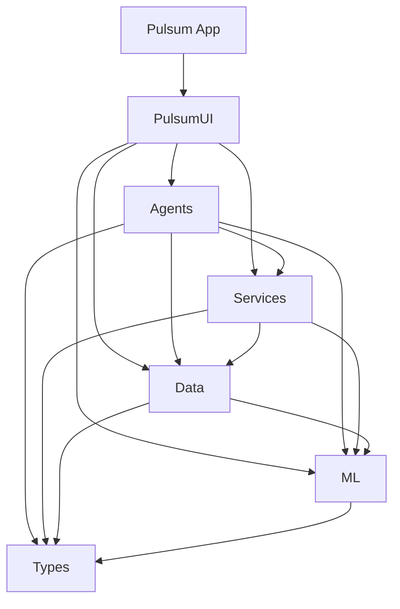

# Pulsum Codebase Baseline

## Table of Contents
- [1) Repo Inventory](#1-repo-inventory)
- [2) Build & Runtime Entry Points](#2-build--runtime-entry-points)
- [3) Architecture Overview](#3-architecture-overview)
- [4) Data & Persistence](#4-data--persistence)
- [5) HealthKit Pipeline](#5-healthkit-pipeline)
- [6) Time & Day Boundary Semantics](#6-time--day-boundary-semantics)
- [7) Wellbeing/Score Calculations](#7-wellbeingscore-calculations)
- [8) Micro Moments Content System](#8-micro-moments-content-system)
- [9) Embeddings & Vector Index](#9-embeddings--vector-index)
- [10) Recommendations Engine](#10-recommendations-engine)
- [11) UI Layer & State](#11-ui-layer--state)
- [12) Background Work & Scheduling](#12-background-work--scheduling)
- [13) Logging, Diagnostics, Privacy, Security](#13-logging-diagnostics-privacy-security)
- [14) Testing & Quality](#14-testing--quality)
- [15) Known Issues / Risks](#15-known-issues--risks)
- [16) Appendix (File Index)](#16-appendix-file-index)

## 1) Repo Inventory

- Modules/targets: Pulsum app (iOS 26 SwiftUI), PulsumTests (empty placeholder), PulsumUITests; SwiftPM packages PulsumUI (UI layer), PulsumAgents (agent orchestration), PulsumServices (HealthKit/Speech/LLM), PulsumData (Core Data + vector index + importer), PulsumML (ML providers, estimator, embeddings, safety/topic gate), PulsumTypes (shared types/logging/notifications/diagnostics types).
- Dependency graph: Types has no deps; ML depends on Types; Data depends on ML+Types; Services depends on Data+ML+Types; Agents depends on Services+Data+ML+Types; UI depends on Agents+Services+Data+ML+Types; App consumes UI.
- Directory map: `Pulsum/` app assets, entitlements, privacy manifest; `Pulsum.xcodeproj/` scheme + workspace; `Packages/` per-package sources/tests/.swiftpm; `scripts/ci/` harnesses; assets (icons, GIF/USdz, spline); inventories (`_git_tracked_files.txt`, `inventory.json`, `baseline 5_2/` previous audit); diagnostics log `PulsumDiagnostics-Latest.txt`; dataset `podcastrecommendations 2.json`; config templates (`Config.xcconfig.template`); prior inventories (`baseline 5_2/*`).
- File counts: 269 tracked (231 text, 37 binary; one missing tracked deletion `gpt5_1_prompt_guide.md`); markdown/PDF skipped per instruction except `architecture.md`.
- Large/binary files: `main.gif` 21.8 MB animation; `codex_inventory.json` 5.1 MB; `coverage_ledger.json` 4.3 MB; `files.zlist` 1.8 MB null-separated manifest; `sha256.txt` 2.8 MB digests; `MAINDESIGN.png` 3.9 MB; `ios app mockup.png` 2.8 MB; `mainanimation.usdz` 47 KB; spline assets 272 KB/49 KB; icon PNGs ~1 MB each; `PulsumDiagnostics-Latest.txt` 43 KB diagnostics.
- Privacy manifests: app + all five packages ship `PrivacyInfo.xcprivacy` (FileTimestamp reason C617.1) validated by `scripts/ci/check-privacy-manifests.sh`; CI enforces one manifest resource reference.
- Technology stack: Swift 6.2, SwiftUI, Core Data, HealthKit, Speech, FoundationModels (AFM), CoreML (embedding + sentiment models), OSLog diagnostics, Keychain, async/await + actors, sharded binary vector index.

## 2) Build & Runtime Entry Points

- Build systems: SwiftPM manifests per package; Xcode project `Pulsum.xcodeproj` with shared scheme `Pulsum` building app + UITests + package test bundles. All packages target iOS 26 / macOS 14; FoundationModels linked conditionally on iOS only. Swift 6.2.1 toolchain.
- Build flags: Services `BuildFlags.swift` toggles UI-test seams (speech/LLM) and gating for modern speech backend via env (`UITEST_FAKE_SPEECH`, `UITEST_USE_STUB_LLM`, `UITEST_FORCE_MODERN_SPEECH_BACKEND`). Strict concurrency enabled in CI harness (`-Xswiftc -strict-concurrency=complete`).
- CLI: `xcodebuild -scheme Pulsum -sdk iphoneos` (Release via `scripts/ci/build-release.sh`); package builds/tests via `swift build` / `swift test` (with Gate_* filters in `scripts/ci/test-harness.sh`); UI tests via `scripts/ci/ui-tests.sh` with stub flags.
- Runtime entry: `PulsumApp` (@main) loads `PulsumRootView`; `AppViewModel.start()` instantiates `AgentOrchestrator`, requests HealthKit, prepares library/importer, probes embeddings, and manages startup state (idle/loading/ready/blocked/failed).
- UITest env: scheme injects `UITEST_USE_STUB_LLM=1`, `UITEST_FAKE_SPEECH=1`, `UITEST_AUTOGRANT=1`; HealthKit overrides via `PULSUM_HEALTHKIT_STATUS_OVERRIDE`/`PULSUM_HEALTHKIT_REQUEST_BEHAVIOR`; URL open capture via `UITEST_CAPTURE_URLS`.
- Config/entitlements: `Config.xcconfig` intentionally empty; template holds OPENAI key placeholder. `Pulsum.entitlements` enables HealthKit + background delivery. API key supplied via Keychain or `PULSUM_COACH_API_KEY` env; Config.xcconfig must remain untracked.
- Scheme wiring: Shared scheme builds app + UITests + package test bundles; PulsumTests target is skipped in scheme; UITest environment variables injected at TestAction level; LaunchAction runs Pulsum app Debug; ArchiveAction builds Release. No remote SwiftPM dependencies pinned (Package.resolved empty).
- CI harness: `scripts/ci/integrity.sh` runs git integrity, placeholder/secret scans, privacy manifest checks, release build, Gate0 package tests, optional privacyreport; `scripts/ci/test-harness.sh` enumerates Gate_* test lists per package and runs UI gates; `scripts/ci/ui-tests.sh` boots specified simulator (default iPhone 17 Pro, iOS 26.1) with stub flags and runs PulsumUITests.

## 3) Architecture Overview

- System context: On-device wellness coach combining HealthKit data, on-device ML (Foundation Models/CoreML/NL), vector search over bundled “micro moments,” and optional cloud GPT-5 phrasing guarded by consent plus safety/topic gates.
- Containers: iOS app (SwiftUI) consuming internal Swift packages; no extensions. Persistence/local ML fully on-device; cloud only via LLMGateway when consented.
- Components: Agents (`AgentOrchestrator` owns lifecycle, embeds `DataAgent` for HK ingestion/scoring, `SentimentAgent` for journaling, `CoachAgent` for recs/chat, `SafetyAgent` for crisis/guardrails, `CheerAgent` for positive reinforcement); Services (`HealthKitService`, `SpeechService`, `LLMGateway`, `KeychainService`); Data (`DataStack`, `LibraryImporter`, `VectorIndexManager`, state stores for backfill/estimator/ranker); ML (`EmbeddingService`, `StateEstimator`, `RecRanker`, `SafetyLocal`, multi-tier sentiment providers, topic gate); UI (view models + SwiftUI views per tab).
- Guardrails: Two-wall safety (SafetyAgent + SafetyLocal fallback) plus topic gate and retrieval coverage before cloud calls. Consent gates cloud LLM; embeddings availability gate controls recommendation quality and library indexing; `pulsumScoresUpdated` notification is the single bus for score updates across agents/UI.
- Agent orchestration: `AgentOrchestrator.start(traceId:)` binds DataAgent, SentimentAgent, CoachAgent, SafetyAgent; prepares library import, probes embeddings, requests HK auth, runs bootstrap/warm backfill, publishes wellbeing snapshots, refreshes recommendations, emits notifications; exposes APIs for `beginVoiceJournal`/`finishVoiceJournal`, `recommendations`, `scoreBreakdown`, `consent` management, embedding reprobes, and reprocessDay. Serializes long-running tasks with async/await; surface errors as `OrchestratorStartupError`.
- Protocol surfaces: `HealthKitServicing`, `SpeechServicing`, `TextEmbeddingProviding`, `HealthKitObservationToken`, and `VectorIndexProviding` decouple concrete services for tests; Sendable actors used for concurrency safety (`DataAgent`, `SpeechService`, `EmbeddingService` singleton).
- Technology touchpoints: Apple Intelligence/AFM foundation models (guarded by availability), CoreML sentiment/embedding models, NaturalLanguage fallback, HealthKit anchored/observer queries, Speech framework, OSLog diagnostics, Keychain for secrets, NotificationCenter for UI refresh.
- Dependency flow (acyclic): PulsumUI → Agents/Data/Services/ML/Types; Agents → Services/Data/ML/Types; Services → Data/ML/Types; Data/ML → Types; Types standalone.

## 4) Data & Persistence

- Core Data stack (`DataStack`): NSPersistentContainer with protected Application Support directories (vector index, health anchors, SQLite) marked `.complete` file protection and excluded from backup; exposes view/background contexts helpers.
- Entities (Pulsum.xcdatamodeld):  
  - `JournalEntry`: UUID id, createdAt/day, transcript, sentimentScore/label, embedding Data BLOB, embeddingPending Bool, sensitiveFlags string, source fields.  
  - `DailyMetrics`: day, sample counts and means for HRV SDNN, HR, resting HR, respiratory rate, steps, sleep minutes/efficiency, sedentary durations.  
  - `Baseline`: key (metric identifier), median, mad, ewma, rollingWindowDays.  
  - `FeatureVector`: date/day, z-scores map (Transformable), contributions map, imputed flags map, wellbeingScore double, relationships to DailyMetrics/Baseline.  
  - `MicroMoment`: id/title/detail/shortDescription, tags (Transformable array), category, difficulty, evidenceBadge, estimatedTimeSec, cooldownSec, sourceURL.  
  - `RecommendationEvent`: cardId/action/timestamp.  
  - `LibraryIngest`: source, checksum, version, ingestedAt.  
  - `UserPrefs` / `ConsentState`: cloud consent toggle, saved GPT key, last prompt state.
- Persistence helpers: `EstimatorStateStore` and `RecRankerStateStore` write JSON snapshots under protected, backup-excluded directories; `BackfillStateStore` tracks warm/full completion per HK identifier and earliest processed date; `HealthKitAnchorStore` persists HK anchors via NSKeyedArchiver with `.complete` protection.
- Vector index: binary sharded store (`VectorIndex`) under `Application Support/VectorIndex/` (16 shards, L2 distance) with file protection and backup exclusion; manager actor handles concurrent upsert/search/remove; journal embeddings stored in dedicated subdir `JournalEntries` as `.vec` files with same protections.
- Data access facade: `PulsumData` exposes container, background contexts, storage paths, and `backupSecurityIssue` to block startup if protection/xattr fail; `PulsumManagedObjectModel` loads the compiled model from module resources with fallbacks.
- Storage details: `DataStack` builds ApplicationSupport/Pulsum, VectorIndex/, HealthAnchors/, and SQLite (`Pulsum.sqlite`) paths; sets `.complete` file protection and NSURLIsExcludedFromBackupKey; merge policy mergeByPropertyObjectTrump on background contexts; context names set for diagnostics. `BackupSecurityIssue` reported when xattr/protection cannot be set, allowing UI to block startup.
- Vector index internals: sharded binary files with versioned header (magic, dimension), per-shard capacity, and record offsets; operations are actor-isolated, use `FileHandle` reading/writing with padding and zero-fill; concurrency tests stress close errors. No automatic rebuild/compaction if corruption occurs—manual delete/recreate required.
- State stores: `BackfillStateStore` JSON tracks warm/full completion per HK identifier and earliest processed date; `EstimatorStateStore`/`RecRankerStateStore` persist weights/bias/lr; all under protected, backup-excluded directories. Consent/key stored in Core Data `ConsentState` (not Keychain) while `KeychainService` stores GPT key for LLMGateway use.

## 5) HealthKit Pipeline

- Permissions: `HealthKitService.readSampleTypes` covers HRV SDNN, heart rate, resting HR, respiratory rate, step count, sleep analysis. `requestAuthorization()` throws on unavailability/denial; DEBUG overrides via env `PULSUM_HEALTHKIT_STATUS_OVERRIDE` (per-type authorized/denied/pending) and `PULSUM_HEALTHKIT_REQUEST_BEHAVIOR=grantAll` for UITests.
- Status probing: `DataAgent.currentHealthAccessStatus()` combines `requestStatusForAuthorization` with per-type read probes (cached 30s) into granted/denied/pending sets plus availability flag; logs diagnostics with detailed probe results.
- Queries: `HealthKitService` sets anchored queries per granted type (initial window last 2 days), observer queries for live updates, and enables background delivery. Anchors stored with `HealthKitAnchorStore`; revoked types stop observers and optionally reset anchors.
- Ingestion lifecycle: `DataAgent.start`/`requestHealthAccess`/`restartIngestionAfterPermissionsChange` → placeholder watchdog (5s) → bootstrap first score (last 2 days) → configure observation (start observers, enable delivery, stop revoked) → schedule backfill tasks. Background-delivery failures with invalid arguments surface as errors; localized “background-delivery” noise is ignored.
- Sample handling: incoming samples grouped by `startOfDay` into daily buckets; quantity/category processing builds `DailyMetrics`, updates baselines, recomputes feature vectors, persists estimator state, and posts `pulsumScoresUpdated`. DebugLogBuffer captures status summaries and observer configuration.
- Anchored update handling: `HealthKitService.startAnchoredQuery` executes HKAnchoredObjectQuery, returning new samples + deleted objects + newAnchor; anchors persisted per type; on failure surfaces `HealthKitServiceError.queryExecutionFailed`. Observer queries re-trigger anchored queries when new data arrives; background delivery enabled via `enableBackgroundDelivery` per granted type.
- Overrides and seams: UITest overrides allow deterministic granted/denied/pending sets; request behavior can auto-grant all for testing; debug logging optional. RequestStatus short-circuit sets all pending when HK says “shouldRequest” so UI can prompt for permissions.
- Metrics coverage: Health access summary in UI uses counts of granted/pending/denied; SettingsViewModel can re-request authorization and refresh status; HealthAccessRequirement describes titles/icons for UI display.

## 6) Time & Day Boundary Semantics

- Day key: consistently `calendar.startOfDay(for:)` (Gregorian, system time zone) in DataAgent for warm/full windows, sample grouping, snapshot dates, baseline updates (multiple call sites lines ~351, 432, 1060, 1330, 1602, 2042).
- Windows: bootstrap uses last 2 days; warm start covers today -6 days; full analysis covers 30 days from today’s start; placeholder creation also keyed to `Date()` → startOfDay.
- Caches/timeouts: read-access probe cache TTL 30s; bootstrap watchdog fires after 5s wall clock; backfill retries capped (attempts/time) irrespective of wall-clock day.
- Risks: async tasks across midnight/DST may compute different “today,” producing duplicate/skipped snapshots; `BackfillStateStore.earliestProcessedDate` fallback to `Date()` (line ~1614) can skip historic data after state reset; no midnight invalidation of estimator/backfill caches.
- Missing tests: day-boundary rollover for ingestion/snapshot/reset, DST/timezone changes, placeholder replacement after midnight, backfill recovery when earliest date defaults to “now.”

## 7) Wellbeing/Score Calculations

- Pipeline: HealthKit samples → `DailyMetrics` aggregates → baselines via `BaselineMath` (median/MAD z-scores, EWMA, percentile) → `FeatureVector` with imputed flags → `StateEstimator` produces wellbeingScore + per-signal contributions (persisted via EstimatorStateStore) → `ScoreBreakdown` mapping to UI metrics.
- Feature mapping: objective signals (HRV, HR, restingHR, respiratory rate, steps, sleep minutes/efficiency, sedentary) plus subjective sliders and sentiment; z-scores computed against rolling baselines; imputed flags mark missing signals with placeholder weighting caps. Sleep debt window 7d; sedentary thresholds 30 steps/hour min 30 min.
- Bootstrap/placeholder: `bootstrapFirstScore` uses 2-day window; watchdog inserts placeholder snapshot if none after 5s; warm/backfill and observer updates replace when available. `reprocessDay(date:)` recomputes a specific day (e.g., after journal) and posts `pulsumScoresUpdated`.
- Score breakdown: `ScoreBreakdown` includes metric details (value/unit/zScore/contribution/baseline stats/coverage notes) and general notes; UI uses `WellbeingScoreState` to present loading/no-data/error.
- Caching/persistence: estimator state + backfill progress persisted; read-access probe cached 30s; RecRanker state cached for feedback; vector index stores embeddings; baseline rows stored per metric key.
- Failure modes: placeholder may linger if ingestion stalls; retry budget limited (2 attempts, 60s); pending HealthKit types block full scoring; imputed flags may persist if baselines not refreshed; no tests for midnight reset or placeholder replacement.
- BaselineMath details: median + MAD for robust z-scores; EWMA smoothing; percentile/medianAbsoluteDeviation used to clamp extremes; rolling window configured per metric; imputation uses median/ewma defaults to avoid zeroing contributions.
- StateEstimator: linear model with weights seeded to favor recovery-positive signals; applies learning rate, weight caps, and gradient updates from feedback (RecRanker feedback updates RecRanker; StateEstimator persists for wellbeing). Contribution calculations exposed for UI breakdown; weights persisted to disk.
- Subjective/sentiment blending: subjective sliders stored in `DailyMetrics` and included in feature vector; sentiment score from SentimentAgent normalized/clamped in estimator; flags mark sentiment-imputed days.

## 8) Micro Moments Content System

- Data source: bundled JSON (`podcastrecommendations 2.json`) of episodes with nested recommendations (fields: recommendation, short/detailed descriptions, microActivity, researchLink, difficultyLevel, timeToComplete, tags, category, cooldownSec).
- Ingestion: `LibraryImporter` discovers JSON (default subdir “json database” or root), decodes with checksum, upserts `MicroMoment` records (title/detail/shortDescription/tags/difficulty/category/evidenceBadge/time/cooldown/sourceURL) and `LibraryIngest` row (source, checksum, version="1", ingestedAt).
- Indexing: builds `MicroMomentIndexPayload` (id from episode/recommendation strings) and calls `VectorIndexManager` to upsert embeddings. If `EmbeddingService` unavailable (`EmbeddingError.generatorUnavailable`), import defers and sets `lastImportHadDeferredEmbeddings = true` without indexing.
- Idempotency/versioning: checksum short-circuits unchanged resources; ingestion runs in background context with merge-by-property policy; evidence badge computed via `EvidenceScorer` (strong/medium/weak) based on researchLink domain; time strings parsed to seconds with sensible defaults; stats logged via Diagnostics + stall monitor; retries supported via CoachAgent `retryDeferredLibraryImport`.
- Identifier scheme: IDs derived from episode number + recommendation text, sanitized to alphanumerics with dashes; ensures deterministic upserts across runs. Short description stored separately from detail, enabling concise card rendering while detail feeds embeddings.
- Deferred embeddings: when deferral occurs, Core Data entities still upserted (library visible in DB) but not indexed; CoachAgent monitors `libraryEmbeddingsDeferred` and retries when EmbeddingService becomes available; Diagnostics logs `library.import.deferred`.

## 9) Embeddings & Vector Index

- Providers: `EmbeddingService` (dim 384) with AFM primary (`AFMTextEmbeddingProvider`) when available, CoreML fallback (`PulsumFallbackEmbedding.mlmodel`) otherwise; debug availability override supported. Availability cached with 1h reprobe interval and re-probed when FoundationModels become ready.
- Decision tree: `availabilityMode(trigger:)` reads cache; `refreshAvailability(force:)` re-probes primary provider with sentinel text; unavailable state recorded with lastChecked timestamp; debug override via `PULSUM_EMBEDDINGS_AVAILABLE` (parsed in DEBUG). Zero-vectors rejected by `validated(_:)`; empty segments throw `EmbeddingError.emptyResult`.
- Failure handling: LibraryImporter defers indexing when `EmbeddingError.generatorUnavailable`; `CoachAgent` shows limited notice and uses keyword/rule fallback; `SentimentAgent` marks `embeddingPending` on JournalEntry and retries reprocessing; `VectorIndexManager` surfaces failures to callers.
- Storage: `VectorIndex` uses 16 shards of binary files under protected `Application Support/VectorIndex`; supports upsert/search/remove, versioned headers, and stats; no automated rebuild/compaction beyond delete/recreate via actor API.
- Providers detail: AFM uses `NLContextualEmbedding` when available; CoreML fallback loads bundled `PulsumFallbackEmbedding.mlmodel`; NaturalLanguage may be used indirectly via AFM; dimension fixed at 384; text normalized/padded/truncated; vectors normalized and zero-checked.
- Availability probing: sentinel text “pulsum-availability-check” used to test provider; caches state (unknown/probing/available/unavailable(lastChecked)); re-probe triggered when FoundationModels becomes ready or cooldown elapsed; debug override via env in DEBUG builds.
- Segment averaging: `embedding(forSegments:)` averages non-empty segment vectors element-wise; throws on empty; used for multi-part inputs (topic gate, RecRanker features) to ensure consistent dimensions.

## 10) Recommendations Engine

- Trigger: UI requests recommendations when a `FeatureVectorSnapshot` is available (CoachViewModel). AgentOrchestrator ensures library prepared and embeddings available.
- Pipeline (CoachAgent): prepare/import library → build query from snapshot signals → vector search topK=20 micro moments → convert to candidates with feature metadata → rank via `RecRanker` (pairwise SGD, state persisted) → return top 3 `RecommendationCard`s.
- Fallbacks: if embeddings unavailable or no matches, sets notice (“Personalized recommendations are limited…”) and uses `fallbackRecommendations` from `CoachAgent+Coverage` (heuristic micro activities keyed off dominant signal/topic). Library import deferral persists until embeddings available.
- Gating: chat/LLM path requires consent and passes SafetyAgent + topic gate before LLMGateway; recommendation route always local but limited when vector index empty/deferred. UI surfaces limited notice when embedding deferral flag is set; empty state possible if library missing and fallback yields none.
- Feedback: RecRanker updates weights via `updateWeights` on acceptance/skip feedback; events persisted as `RecommendationEvent`. Coverage helper converts distances to coverage score with thresholds/soft passes and applies data-sparse soft allow.
- Cloud phrasing: If consented and GPT key present, LLMGateway can augment chat responses using candidate moment summaries; otherwise on-device messaging is used. Safety/topic/coverage guards still apply.
- RecRanker details: pairwise ranking over features (distance, sentiment, sleep debt, step deltas, HRV, HR, respiratory, resting HR, tags match); learning rate/clamp; persist/load state from disk; defaults seeded for recovery-positive bias.
- Topic/coverage guardrail: Topic gate uses embedding or FoundationModels classifier to ensure on-topic replies; coverage ensures at least one grounding signal before cloud escalation; consent off routes to local responses with safety messaging.
- Chat path: `CoachAgent.chatResponse` redacts PII, builds rationale from top 3 contributions, gathers recommendation highlights, then LLMGateway validates schema for GPT-5 Responses API; failures fall back to deterministic local reply.

## 11) UI Layer & State

- Shell: `PulsumRootView` tabs (Pulse, Scores, Coach, Settings), overlays for consent/safety cards, modals for pulse recorder and settings.
- View models: `AppViewModel` handles startup/orchestrator lifecycle, consent banners, retries, and listens for score updates; `PulseViewModel` coordinates voice journal begin/stream/finish, sliders, saved toast, transcript visibility; `ScoreBreakdownViewModel` loads `ScoreBreakdown`; `CoachViewModel` manages recommendations, chat messages, notices, retries deferred library import; `SettingsViewModel` manages cloud key/consent persistence, test/ping, HealthKit status/requests, diagnostics toggles/export, foundation model status.
- Async propagation: NotificationCenter (`pulsumScoresUpdated`, diagnostics) triggers UI refresh; view models rely on async/await tasks and @Published state; UITest seams toggle deterministic speech/LLM paths.
- Navigation flow: Onboarding requests HealthKit via AppViewModel; Pulse sheet opens recorder; Settings sheet for consent/key; Coach tab shows chat + recommendation cards with limited-state messaging.
- Voice journaling UI: PulseView displays start/stop controls, waveform levels via `LiveWaveformLevels` ring buffer, streaming transcript bound to `speechStream` segments, and slider-based subjective inputs. Saved toast (`VoiceJournalSavedToast`) appears after `finishVoiceJournal` success; transcript persists until cleared.
- Settings UI specifics: Cloud consent toggle (“Use GPT-5 phrasing”), secure API key field with Save/Test, status badge; Health access summary (“granted/pending/denied”), request button; diagnostics toggles (enable logging/persistence/export report); foundation model availability/status strings surfaced from Agents/Services.
- Scores UI: Score card shows wellbeing state (loading/placeholder/ready/denied/error), latest score, and quick notes; score breakdown sheet lists metric contributions, baselines, imputed flags, and recommendation highlights; uses `ScoreBreakdownViewModel` to fetch from orchestrator.
- Coach UI: Chat bubbles, send button, typing indicator, recommendation cards rendered in list with evidence badges and estimated time; limited-mode banner when embeddings deferred; consent banner at top when cloud disabled.
- Onboarding: Carousel of intro screens, HealthKit permission CTA, status rows reflecting HealthAccessRequirement, summary button; uses AppViewModel to trigger HK request and refresh status.

## 12) Background Work & Scheduling

- No BGTaskScheduler integration; background behavior relies on HealthKit background delivery plus long-running Tasks.
- `DataAgent` schedules: observer queries with HK background delivery, `bootstrapWatchdogTask` (placeholder after 5s), `backgroundBackfillTask` for warm/full backfill (warmStart7d + full30d phases with stall monitors), limited retries (max 2 attempts, 60s total), and debounced snapshot notifications.
- `HealthKitService` enables background delivery per granted type and persists anchors for resumed anchored queries; delivery errors surfaced except localized background-delivery noise.
- Diagnostics/log flushing run on demand; no periodic timers besides UI animation (GlowEffect) and backfill stall monitors.
- Orchestrator background behavior: `refreshDeferred` probes embeddings and retries deferred library import; backfill tasks may run after startup in background contexts; UI relies on notifications not polling timers. No background fetch/remote notifications implemented.
- SpeechService timers limited to waveform buffer refresh and authorization cache; no long-running audio background tasks (app foreground-only recorder).

## 13) Logging, Diagnostics, Privacy, Security

- Logging: `Diagnostics` API emits structured events with OSLog signposts (per-category logs), async writer (`DiagnosticsLogger`) persisting to protected directories with rotation; `DebugLogBuffer` ring buffer for in-memory debug lines. Stall monitors (`DiagnosticsStallMonitor`) heartbeat long operations (backfill, library import). Config (`DiagnosticsConfigStore`) toggles min level, persistence, OSLog signposts, stall monitor enabling via SettingsViewModel.
- Privacy/PII: `PIIRedactor` strips emails/phones/names before cloud calls; privacy manifests declared for app + packages; KeychainService stores secrets with `.whenUnlockedThisDeviceOnly`; Core Data/vector index/anchors use `.complete` file protection and are excluded from backups. SpeechService logging policy disables transcript logging in Release.
- Diagnostics export: `DiagnosticsReport` builds headers (version/device/os), snapshot (health/embeddings/backfill), and log tail; SettingsViewModel exposes enable/disable persistence and export buttons. `PulsumDiagnostics-Latest.txt` sample shows backfill phases, embedding availability probes, and HK errors.
- Security checks: CI scripts scan for secrets/placeholders, validate privacy manifests, enforce no tracked Build artifacts; entitlements limited to HealthKit + background delivery; `scan-secrets.sh` can run on built .app bundles.
- DebugLogBuffer: in-memory ring buffer (capacity default 500) capturing lightweight text lines; used by DataAgent for status traces; cleared via diagnostics clear.
- DiagnosticsPaths: defines directories for logs/export/report under Application Support; uses backup exclusion and `.complete` protection; SettingsViewModel toggles persistence and can export a report file.
- Speech logging policy: `SpeechLoggingPolicy` disables transcript logging in Release and is audited in `Gate0_SpeechServiceLoggingTests` by scanning built binary for log marker string.
- Keychain: GPT key stored via `KeychainService` (device-only); LLMGateway resolves key precedence (in-memory, keychain, env) and validates presence before network calls; tests cover precedence.

## 14) Testing & Quality

- Test targets:  
  - PulsumTests (app) — empty placeholder.  
  - PulsumAgentsTests — Gate2–Gate7 coverage: guardrails, consent routing, backfill phasing, estimator persistence/weights, journal session uniqueness, embedding degradation, RecRanker learning/persistence, freshness bus, ingestion idempotence.  
  - PulsumServicesTests — speech auth/logging, modern speech backend flag, LLM key resolution/schema/ping, HealthKit anchor store, keychain.  
  - PulsumDataTests — DataStack security/backup, importer atomicity/perf, vector index concurrency/file-handle/actor, bootstrap, basic vector search.  
  - PulsumMLTests — embedding availability/fallback/contextual tests, topic gate margins, safety local, estimator/rec ranker basics, package embed version.  
  - PulsumUITests — permissions, Health access UI, cloud consent UI, journal flow streaming/saved toast, coach chat stub, settings toggle persistence.  
- CI harness (`scripts/ci/test-harness.sh`) dynamically runs Gate_* suites per package under strict concurrency and runs UI gates with UITEST flags; Release audit for speech logging in Gate0 tests. Scheme includes package tests and UITests; PulsumTests skipped by scheme.
- Gaps/outdated: CLAUDE.md notes tests ~17 days behind code; new voice streaming begin/finish API, recent backfill tweaks, and UI flows not fully covered. Missing critical tests: midnight/day-boundary reset, embedding fallback reprobe across restarts, limited/empty recommendation messaging, placeholder replacement, modern speech backend behavior, vector index corruption recovery.
- Test data/seams: UITests rely on fake speech backend (`UITEST_FAKE_SPEECH=1`) streaming deterministic transcript (“Energy feels steady…”), stub LLM (`UITEST_USE_STUB_LLM=1`) for deterministic replies, and HealthKit override env for granted/denied sets. Keychain/LLM tests use URLProtocol stub (`LLMURLProtocolStub`) to avoid network; in-memory Core Data via `TestCoreDataStack` provides isolated contexts.
- Coverage artifacts: `coverage_ledger.json` and `codex_inventory.json` list file intents/status; note most tests predate Oct 23 changes (voice streaming/backfill tweaks), so passing suites are weak quality signals.

## 15) Known Issues / Risks

- Day-boundary drift: DataAgent computes “today” via `calendar.startOfDay(for: Date())` in multiple async tasks (e.g., lines ~351, 432, 1602) so midnight/DST crossovers can duplicate/skip snapshots; no reset tests.
- Earliest-processed fallback: `BackfillStateStore.earliestProcessedDate` defaults to `Date()` (DataAgent ~1614) after state loss/new types, potentially skipping historic backfill.
- Embedding availability fragility: Devices without AFM/CoreML leave `EmbeddingService` unavailable → LibraryImporter defers forever and CoachAgent serves fallback/empty recs; no user-driven reprobe or recovery tests.
- Modern speech stub: SpeechService modern path returns legacy fallback (stub lines ~272-303), so iOS26 speech APIs unimplemented while tests may still pass.
- HealthKit error surfacing: HK errors (code 11) seen in `PulsumDiagnostics-Latest.txt` during heart-rate updates log but keep running; prolonged failures could starve metrics/backfill without UI notice.
- Placeholder persistence: Bootstrap watchdog inserts placeholder snapshot; if ingestion stalls it may remain the latest score indefinitely with `snapshot_placeholder` flag.
- Consent/cloud key drift: Cloud consent/key persisted via SettingsViewModel without guard against revoked consent vs cached key; LLMGateway could attempt cloud calls unexpectedly.
- Vector index recovery: No rebuild/repair path if shard files corrupt; journal embeddings stored alongside micro moments without integrity checks beyond try/catch.
- Recommendation empties: If library missing/deferred and fallback yields none, coach UI may show empty state without remediation; no UITest coverage for this path.
- Outdated test suite: Majority of tests reflect pre–Oct 23 behavior; passing suites are not reliable for current voice streaming/backfill/recommendation flows.
- Backfill pacing: Retry budget small (2 attempts, 60s) so transient HK outages can leave baselines stale without further retries; no user-facing alert beyond diagnostics.
- Estimator/ranker persistence: JSON snapshot corruption not validated; load failures fall back to defaults silently, risking unexpected score/rank behavior without warning.
- Consent/diagnostics privacy: Diagnostics persistence defaults to enabled; while no raw PHI is logged, misconfiguration could retain more context than desired; export not encrypted beyond file protection.
## 16) Appendix (File Index)

- `.github/coderabbit.yaml` — CodeRabbit review configuration enabling auto reviews, path-specific review focus areas, and chat/analysis settings for the repo.
- `.github/workflows/auto-merge.yml` — GitHub Actions workflow to optionally auto-merge PRs after approval/checks via manual dispatch or labeled PRs.
- `.github/workflows/auto-pr.yml` — Workflow that auto-creates PRs on branch pushes (feature/bugfix/hotfix/refactor/chore) using gh CLI with auto-created label.
- `.github/workflows/test-harness.yml` — macOS 15 CI job installing ripgrep/xcbeautify and running `scripts/ci/test-harness.sh` with iOS 26 simulator env.
- `.gitignore` — Ignore rules for Xcode user data, build outputs, package caches, IDE configs, logs, and local secrets (Config.xcconfig).
- `CLAUDE.md` — Repository assistant guidance covering critical context (outdated tests, privacy manifests, voice journal API change), architecture, setup, and known stubs.
- `COMPREHENSIVE_BUG_ANALYSIS.md` — 2025-11-11 architectural bug analysis detailing 44 issues (S0–S2), evidence snippets, and recommended fixes/testing gaps.
- `ChatGPT for engineers - Resource _ OpenAI Academy.pdf` — Binary PDF (3.98 MB); content not viewable in text, requires PDF reader.
- `Docs/a-practical-guide-to-building-with-gpt-5.pdf` — Binary PDF (12.0 MB) reference guide; not readable as text here.
- `Docs/architecture copy.md` — Extensive Oct 2025 architecture manual detailing package structure, algorithms, data flows, and integration notes across Pulsum layers.
- `Docs/architecture_short copy.md` — Condensed Oct 2025 architecture summary covering packages, pipelines, data flow, guardrails, and key algorithms.
- `Docs/chat1.md` — Milestone 0–3 progress summary outlining architecture scaffolding, DataAgent/Sentiment/Coach/Safety/Cheer status, and remaining tasks.
- `Docs/chat2.md` — Continuation log summarizing Milestone 3 completion details (agents, RecRanker, tests, entitlements) and future milestone plans.
- `GITHUB_WORKFLOW.md` — Guide to Git/GitHub workflow for the repo including branching, auto PR/merge workflows, and CodeRabbit integration.
- `MAINDESIGN.png` — Binary PNG design asset (3.87 MB); not readable as text.
- `Packages/PulsumAgents/Package.swift` — SwiftPM manifest for PulsumAgents target linking PulsumData/Services/ML/Types with FoundationModels (iOS) and processing PrivacyInfo.xcprivacy/resource fixtures.
- `Packages/PulsumAgents/Sources/PulsumAgents/AgentOrchestrator.swift` — Main orchestrator coordinating agents, startup flow, embeddings refresh, voice journaling (begin/finish/legacy), snapshot/recommendation retrieval with timeouts, chat routing (safety/topic/coverage), and diagnostics publishing.
- `Packages/PulsumAgents/Sources/PulsumAgents/BackfillStateStore.swift` — Persists backfill progress JSON with file protection/backup exclusion; tracks warm/full completion per HK type and earliest processed dates.
- `Packages/PulsumAgents/Sources/PulsumAgents/CheerAgent.swift` — @MainActor helper producing completion messages/haptics based on time-of-day qualifiers.
- `Packages/PulsumAgents/Sources/PulsumAgents/CoachAgent+Coverage.swift` — Coverage scoring utilities converting L2 distances to similarity, applying thresholds, data-sparse soft passes, and logging decisions.
- `Packages/PulsumAgents/Sources/PulsumAgents/CoachAgent.swift` — Coach agent managing library ingestion, vector search, ranking via RecRanker, chat generation through LLMGateway, candidate backfill, keyword fallback, acceptance logging, and caution messaging (FM-enabled).
- `Packages/PulsumAgents/Sources/PulsumAgents/DataAgent.swift` — Actor handling HealthKit auth/observers, bootstrap/backfill with retries, sample processing to DailyMetrics flags, baseline updates, feature vector creation, wellbeing modeling/score breakdown, snapshot notifications, and state persistence.
- `Packages/PulsumAgents/Sources/PulsumAgents/EstimatorStateStore.swift` — File-backed persistence for StateEstimator weights with protection/backup exclusion and schema versioning.
- `Packages/PulsumAgents/Sources/PulsumAgents/HealthAccessStatus.swift` — Data structure summarizing HealthKit authorization availability, granted/denied/pending sets, and helper flags.
- `Packages/PulsumAgents/Sources/PulsumAgents/PrivacyInfo.xcprivacy` — Privacy manifest declaring FileTimestamp accessed API reason C617.1; no collected data/tracking domains.
- `Packages/PulsumAgents/Sources/PulsumAgents/PulsumAgents.swift` — Public facade exposing orchestrator creation, storage health check, and Foundation Models status string.
- `Packages/PulsumAgents/Sources/PulsumAgents/RecRankerStateStore.swift` — Persists RecRanker state JSON with file protection/backup exclusion and schema validation.
- `Packages/PulsumAgents/Sources/PulsumAgents/SafetyAgent.swift` — @MainActor safety classifier using FoundationModelsSafetyProvider when available with keyword adjustments and SafetyLocal fallback producing SafetyDecision.
- `Packages/PulsumAgents/Sources/PulsumAgents/SentimentAgent.swift` — @MainActor agent managing speech recording sessions, PII redaction, sentiment scoring, embedding persistence for journals, pending reprocessing, and session state guardrails.
- `Packages/PulsumAgents/Sources/PulsumAgents/WellbeingScoreState.swift` — Enum modeling wellbeing state/loading/no-data/error reasons used by UI.
- `Packages/PulsumAgents/Tests/PulsumAgentsTests/AgentSystemTests.swift` — XCTest cases validating FM availability, SafetyAgent crisis detection, orchestrator startup, and PII redaction in SentimentAgent.
- `Packages/PulsumAgents/Tests/PulsumAgentsTests/ChatGuardrailAcceptanceTests.swift` — Acceptance-style tests with harness covering chat routing for greetings, consent on/off paths, off-topic redirects, and topic mapping.
- `Packages/PulsumAgents/Tests/PulsumAgentsTests/ChatGuardrailTests.swift` — Testing DSL specs asserting two-wall guardrail expectations, redirect messages, coverage thresholds, and topic gate keyword mapping.
- `Packages/PulsumAgents/Tests/PulsumAgentsTests/DebugLogBufferTests.swift` — Ensures DebugLogBuffer ring buffer evicts old entries after capacity.
- `Packages/PulsumAgents/Tests/PulsumAgentsTests/Gate2_JournalSessionTests.swift` — Verifies JournalSessionState rejects duplicate sessions and clears transcript on take.
- `Packages/PulsumAgents/Tests/PulsumAgentsTests/Gate2_OrchestratorLLMKeyAPITests.swift` — Tests orchestrator LLM key storage/ping via stubbed URLProtocol and keychain.
- `Packages/PulsumAgents/Tests/PulsumAgentsTests/Gate2_TypesWiringTests.swift` — Simple construction check for SpeechSegment DTO.
- `Packages/PulsumAgents/Tests/PulsumAgentsTests/Gate3_FreshnessBusTests.swift` — Confirms DataAgent snapshot notifications debounce and post expected date payload.
- `Packages/PulsumAgents/Tests/PulsumAgentsTests/Gate3_HealthAccessStatusTests.swift` — Validates health access classification and observer management when permissions change/denied/pending.
- `Packages/PulsumAgents/Tests/PulsumAgentsTests/Gate3_IngestionIdempotenceTests.swift` — Ensures restarting ingestion avoids duplicate observers and stops revoked types with HealthKitServiceStub.
- `Packages/PulsumAgents/Tests/PulsumAgentsTests/Gate4_ConsentRoutingTests.swift` — Tests LLMGateway routing cloud vs local based on consent flags.
- `Packages/PulsumAgents/Tests/PulsumAgentsTests/Gate4_LLMKeyTests.swift` — Verifies LLMGateway key round-trip with stub keychain and ping payload validation.
- `Packages/PulsumAgents/Tests/PulsumAgentsTests/Gate4_RoutingTests.swift` — Checks TopicSignalResolver mapping, deterministic topic override, and candidate moment handling with stub vector index.
- `Packages/PulsumAgents/Tests/PulsumAgentsTests/Gate6_EmbeddingAvailabilityDegradationTests.swift` — Ensures coach recommendations fall back with notice when embeddings unavailable.
- `Packages/PulsumAgents/Tests/PulsumAgentsTests/Gate6_RecRankerLearningTests.swift` — Tests CoachAgent feedback updating RecRanker weights and ranking order.
- `Packages/PulsumAgents/Tests/PulsumAgentsTests/Gate6_RecRankerPersistenceTests.swift` — Confirms RecRanker state persists across agent restarts via RecRankerStateStore.
- `Packages/PulsumAgents/Tests/PulsumAgentsTests/Gate6_SentimentJournalingFallbackTests.swift` — Validates journal persistence when embeddings fail, marking pending state.
- `Packages/PulsumAgents/Tests/PulsumAgentsTests/Gate6_StateEstimatorPersistenceTests.swift` — Tests StateEstimator state persistence across DataAgent instances using EstimatorStateStore.
- `Packages/PulsumAgents/Tests/PulsumAgentsTests/Gate6_StateEstimatorWeightsAndLabelsTests.swift` — Asserts wellbeing model weights give higher scores for recovery signals and clamp imputed signals.
- `Packages/PulsumAgents/Tests/PulsumAgentsTests/Gate6_WellbeingBackfillPhasingTests.swift` — Extensive tests covering warm-start/backfill phasing, bootstrap fallback, sleep debt imputation, and overlapping backfill correctness.
- `Packages/PulsumAgents/Tests/PulsumAgentsTests/Gate6_WellbeingStateMappingTests.swift` — Maps HealthAccessStatus variants to WellbeingScoreState expectations.
- `Packages/PulsumAgents/Tests/PulsumAgentsTests/HealthKitServiceStub.swift` — HealthKitServicing test double tracking observed identifiers, fetch requests, probes, and background delivery calls.
- `Packages/PulsumAgents/Tests/PulsumAgentsTests/TestCoreDataStack.swift` — In-memory NSPersistentContainer factory using Pulsum model for tests.
- `Packages/PulsumData/Package.swift` — SwiftPM manifest for PulsumData with PulsumML/PulsumTypes dependencies and Core Data resources.
- `Packages/PulsumData/Sources/PulsumData/Bundle+PulsumDataResources.swift` — Bundle locator for PulsumData resources under SwiftPM or app context.
- `Packages/PulsumData/Sources/PulsumData/DataStack.swift` — Core Data stack setup with protected directories, backup exclusion, persistent container config, and background context helpers.
- `Packages/PulsumData/Sources/PulsumData/EvidenceScorer.swift` — Domain-based evidence badge scorer returning strong/medium/weak.
- `Packages/PulsumData/Sources/PulsumData/LibraryImporter.swift` — Imports podcast recommendation JSON, upserts Core Data entities, embeds content, tracks checksum/version, and handles deferred embeddings.
- `Packages/PulsumData/Sources/PulsumData/Model/ManagedObjects.swift` — NSManagedObject subclasses and fetch helpers for JournalEntry, DailyMetrics, Baseline, FeatureVector, MicroMoment, RecommendationEvent, LibraryIngest, UserPrefs, ConsentState.
- `Packages/PulsumData/Sources/PulsumData/PrivacyInfo.xcprivacy` — Privacy manifest listing FileTimestamp accessed API (reason C617.1); no collected data/tracking domains.
- `Packages/PulsumData/Sources/PulsumData/PulsumData.swift` — Public facade exposing DataStack, contexts, storage paths, and backupSecurityIssue.
- `Packages/PulsumData/Sources/PulsumData/PulsumManagedObjectModel.swift` — Loader for Pulsum Core Data model across bundled mom/momd/xcdatamodeld resources with fallbacks.
- `Packages/PulsumData/Sources/PulsumData/Resources/Pulsum.xcdatamodeld/.xccurrentversion` — Declares current Core Data model version `Pulsum.xcdatamodel`.
- `Packages/PulsumData/Sources/PulsumData/Resources/Pulsum.xcdatamodeld/Pulsum.xcdatamodel/contents` — Core Data schema XML defining entities/attributes for JournalEntry, DailyMetrics, Baseline, FeatureVector, MicroMoment, RecommendationEvent, LibraryIngest, UserPrefs, ConsentState.
- `Packages/PulsumData/Sources/PulsumData/Resources/PulsumCompiled.momd/Pulsum.mom` — Binary compiled Core Data model (8.8 KB); not readable as text.
- `Packages/PulsumData/Sources/PulsumData/Resources/PulsumCompiled.momd/Pulsum.omo` — Binary optimized Core Data model (22.1 KB); not readable as text.
- `Packages/PulsumData/Sources/PulsumData/Resources/PulsumCompiled.momd/VersionInfo.plist` — Binary version info for compiled model (743 bytes); not human-readable.
- `Packages/PulsumData/Sources/PulsumData/VectorIndex.swift` — Implements binary vector index with sharded files, metadata, L2 search, and robust file handle handling.
- `Packages/PulsumData/Sources/PulsumData/VectorIndexManager.swift` — Actor wrapper coordinating VectorIndex CRUD and embedding lookups with availability gating.
- `Packages/PulsumData/Tests/PulsumDataTests/DataStackSecurityTests.swift` — Verifies DataStack directories exist, are protected, and excluded from backups.
- `Packages/PulsumData/Tests/PulsumDataTests/Gate0_DataStackSecurityTests.swift` — Additional backup exclusion test coverage for PHI directories.
- `Packages/PulsumData/Tests/PulsumDataTests/Gate5_LibraryImporterAtomicityTests.swift` — Ensures library import/checksum/indexing atomically update and retry correctly.
- `Packages/PulsumData/Tests/PulsumDataTests/Gate5_LibraryImporterPerfTests.swift` — Measures import performance and concurrent fetch impact.
- `Packages/PulsumData/Tests/PulsumDataTests/Gate5_VectorIndexConcurrencyTests.swift` — Stress-tests VectorIndex actor under concurrent upsert/search/remove.
- `Packages/PulsumData/Tests/PulsumDataTests/Gate5_VectorIndexFileHandleTests.swift` — Validates file handle error propagation on close.
- `Packages/PulsumData/Tests/PulsumDataTests/LibraryImporterTests.swift` — Tests ingest checksum dedupe, indexing, and vector updates.
- `Packages/PulsumData/Tests/PulsumDataTests/PulsumDataBootstrapTests.swift` — Confirms DataStack initialization paths and directory creation.
- `Packages/PulsumData/Tests/PulsumDataTests/Resources/podcasts_sample.json` — Fixture JSON sample for library importer tests.
- `Packages/PulsumData/Tests/PulsumDataTests/VectorIndexTests.swift` — Checks vector index search/upsert/remove behavior and versioning.
- `Packages/PulsumML/Package.swift` — SwiftPM manifest for PulsumML library with PulsumTypes dependency, resources, and FoundationModels linking on iOS.
- `Packages/PulsumML/Sources/PulsumML/AFM/FoundationModelsAvailability.swift` — Runtime checks for Apple Intelligence availability with stubbed AFM flag.
- `Packages/PulsumML/Sources/PulsumML/AFM/FoundationModelsStub.swift` — Typed stub LanguageModelSession that throws unavailable to trigger fallbacks.
- `Packages/PulsumML/Sources/PulsumML/AFM/README_FoundationModels.md` — Notes on Foundation Models usage and stub behavior.
- `Packages/PulsumML/Sources/PulsumML/BaselineMath.swift` — Robust stats utilities (median/MAD, EWMA, percentile) for baseline computations.
- `Packages/PulsumML/Sources/PulsumML/Bundle+PulsumMLResources.swift` — Resource bundle locator for PulsumML assets.
- `Packages/PulsumML/Sources/PulsumML/Embedding/AFMTextEmbeddingProvider.swift` — Embedding provider using NLContextualEmbedding with fallback and availability override.
- `Packages/PulsumML/Sources/PulsumML/Embedding/CoreMLEmbeddingFallbackProvider.swift` — Loads bundled CoreML embedding model and returns normalized vectors.
- `Packages/PulsumML/Sources/PulsumML/Embedding/EmbeddingError.swift` — Error cases for embedding providers.
- `Packages/PulsumML/Sources/PulsumML/Embedding/EmbeddingService.swift` — Coordinates embedding providers, availability probes, retries, and zero-vector rejection.
- `Packages/PulsumML/Sources/PulsumML/Embedding/TextEmbeddingProviding.swift` — Protocol for embedding providers.
- `Packages/PulsumML/Sources/PulsumML/Placeholder.swift` — Exposes PulsumML version string.
- `Packages/PulsumML/Sources/PulsumML/PrivacyInfo.xcprivacy` — Privacy manifest listing FileTimestamp accessed API reason C617.1; no collected data/tracking.
- `Packages/PulsumML/Sources/PulsumML/RecRanker.swift` — Pairwise ranking model with SGD updates, clamping, and contribution metrics.
- `Packages/PulsumML/Sources/PulsumML/Resources/PulsumFallbackEmbedding.mlmodel` — Binary CoreML embedding model (410,814 bytes); not human-readable.
- `Packages/PulsumML/Sources/PulsumML/Resources/PulsumSentimentCoreML.mlmodel` — Binary sentiment CoreML model (5,491 bytes); not human-readable.
- `Packages/PulsumML/Sources/PulsumML/Resources/README_CreateModel.md` — Instructions for regenerating the CoreML models.
- `Packages/PulsumML/Sources/PulsumML/Safety/FoundationModelsSafetyProvider.swift` — Safety classifier using FoundationModels with fallback redaction strings.
- `Packages/PulsumML/Sources/PulsumML/SafetyLocal.swift` — Local heuristic safety classification with crisis/warn/safe labels.
- `Packages/PulsumML/Sources/PulsumML/Sentiment/AFMSentimentProvider.swift` — Sentiment provider using FoundationModels with availability guard.
- `Packages/PulsumML/Sources/PulsumML/Sentiment/CoreMLSentimentProvider.swift` — Sentiment provider using bundled CoreML model.
- `Packages/PulsumML/Sources/PulsumML/Sentiment/FoundationModelsSentimentProvider.swift` — Foundation Models sentiment provider with retry and clipping.
- `Packages/PulsumML/Sources/PulsumML/Sentiment/NaturalLanguageSentimentProvider.swift` — Natural Language framework fallback sentiment provider.
- `Packages/PulsumML/Sources/PulsumML/Sentiment/PIIRedactor.swift` — PII redaction utility removing emails, phones, names.
- `Packages/PulsumML/Sources/PulsumML/Sentiment/SentimentProviding.swift` — Protocol for sentiment providers.
- `Packages/PulsumML/Sources/PulsumML/Sentiment/SentimentService.swift` — Service chaining sentiment providers with failure handling and clamping.
- `Packages/PulsumML/Sources/PulsumML/StateEstimator.swift` — Linear wellbeing model with SGD updates, contribution reporting, and weight persistence hooks.
- `Packages/PulsumML/Sources/PulsumML/TopicGate/EmbeddingTopicGateProvider.swift` — Topic gate using embedding similarity with margin thresholds.
- `Packages/PulsumML/Sources/PulsumML/TopicGate/FoundationModelsTopicGateProvider.swift` — Topic gate using Foundation Models classification with availability guard.
- `Packages/PulsumML/Sources/PulsumML/TopicGate/TopicGateProviding.swift` — Topic gate protocol and decision struct.
- `Packages/PulsumML/Tests/PulsumMLTests/EmbeddingServiceAvailabilityTests.swift` — Tests embedding availability cache/reprobe behavior.
- `Packages/PulsumML/Tests/PulsumMLTests/EmbeddingServiceFallbackTests.swift` — Ensures fallback provider used when primary fails.
- `Packages/PulsumML/Tests/PulsumMLTests/Gate0_EmbeddingServiceFallbackTests.swift` — Validates fallback with stub provider and probe timing.
- `Packages/PulsumML/Tests/PulsumMLTests/Gate6_EmbeddingProviderContextualTests.swift` — Tests contextual provider use, zero-vector rejection, and averaging.
- `Packages/PulsumML/Tests/PulsumMLTests/PackageEmbedTests.swift` — Confirms version, dimensions, stats utilities, estimator/ranker basics.
- `Packages/PulsumML/Tests/PulsumMLTests/SafetyLocalTests.swift` — Exercises SafetyLocal classifications and thresholds.
- `Packages/PulsumML/Tests/PulsumMLTests/TopicGateMarginTests.swift` — Tests topic gate margin logic.
- `Packages/PulsumML/Tests/PulsumMLTests/TopicGateTests.swift` — Verifies topic gate classification and fallback selection.
- `Packages/PulsumServices/Package.swift` — SwiftPM manifest for PulsumServices linking Data/ML/Types, FoundationModels on iOS, and privacy resources.
- `Packages/PulsumServices/Sources/PulsumServices/BuildFlags.swift` — Shared build flags for UITest seams and modern speech backend overrides.
- `Packages/PulsumServices/Sources/PulsumServices/Bundle+PulsumServicesResources.swift` — Resource bundle locator for PulsumServices.
- `Packages/PulsumServices/Sources/PulsumServices/CoachPhrasingSchema.swift` — JSON schema definition for GPT-5 structured coach phrasing and Responses API format.
- `Packages/PulsumServices/Sources/PulsumServices/FoundationModelsCoachGenerator.swift` — On-device coach generator using Foundation Models with fallback messaging.
- `Packages/PulsumServices/Sources/PulsumServices/HealthKitAnchorStore.swift` — Persists HKQueryAnchor to disk with protection and removal utilities.
- `Packages/PulsumServices/Sources/PulsumServices/HealthKitService.swift` — HealthKit wrapper handling auth, probes, stats queries, anchored/observer queries, background delivery, and anchor persistence.
- `Packages/PulsumServices/Sources/PulsumServices/KeychainService.swift` — Minimal keychain wrapper with shared singleton storing secrets with device-only accessibility.
- `Packages/PulsumServices/Sources/PulsumServices/LLMGateway.swift` — Consent-aware GPT-5 client building minimized payloads, validating schemas, grounding, retries, key resolution, cloud/on-device routing, and stubs for UITests.
- `Packages/PulsumServices/Sources/PulsumServices/Placeholder.swift` — Convenience accessors for shared services and metadata (healthKit, keychain, storage paths, embedding version).
- `Packages/PulsumServices/Sources/PulsumServices/PrivacyInfo.xcprivacy` — Privacy manifest (FileTimestamp accessed API reason C617.1); no collected data/tracking.
- `Packages/PulsumServices/Sources/PulsumServices/SpeechService.swift` — Actor managing speech authorization, backend selection (legacy/modern/fake), streaming transcripts and audio levels, permission seams, and recording lifecycle.
- `Packages/PulsumServices/Tests/PulsumServicesTests/Gate0_LLMGatewayTests.swift` — Tests key resolution precedence and missing-key errors.
- `Packages/PulsumServices/Tests/PulsumServicesTests/Gate0_SpeechServiceAuthorizationTests.swift` — Verifies speech/mic permission error mapping and caching.
- `Packages/PulsumServices/Tests/PulsumServicesTests/Gate0_SpeechServiceLoggingTests.swift` — Release-audit tests ensuring transcript logging disabled and marker absent in binary.
- `Packages/PulsumServices/Tests/PulsumServicesTests/Gate1_LLMGatewayUITestSeams.swift` — Tests UITest stub short-circuit for API ping when flag set.
- `Packages/PulsumServices/Tests/PulsumServicesTests/Gate1_SpeechFakeBackendTests.swift` — Ensures fake backend streams scripted segments under UITEST flag.
- `Packages/PulsumServices/Tests/PulsumServicesTests/Gate2_ModernSpeechBackendTests.swift` — Validates feature flag/availability overrides for modern speech backend selection.
- `Packages/PulsumServices/Tests/PulsumServicesTests/Gate4_LLMGatewayPingSeams.swift` — Tests ping short-circuit when UITEST flag enabled.
- `Packages/PulsumServices/Tests/PulsumServicesTests/HealthKitAnchorStoreTests.swift` — Persists/removes anchors in temp directory with async expectations.
- `Packages/PulsumServices/Tests/PulsumServicesTests/KeychainServiceTests.swift` — Round-trip secret storage/removal tests.
- `Packages/PulsumServices/Tests/PulsumServicesTests/LLMGatewaySchemaTests.swift` — Validates CoachPhrasing schema structure, strictness, payload contents, and token clamping.
- `Packages/PulsumServices/Tests/PulsumServicesTests/LLMGatewayTests.swift` — Tests consent routing, grounding floor, payload structure, schema error fallback, key resolution precedence.
- `Packages/PulsumServices/Tests/PulsumServicesTests/PulsumServicesDependencyTests.swift` — Asserts storage metadata paths and embedding version exposure.
- `Packages/PulsumServices/Tests/PulsumServicesTests/SpeechServiceTests.swift` — Authorization error mapping tests for speech/mic combinations.
- `Packages/PulsumServices/Tests/Support/LLMURLProtocolStub.swift` — URLProtocol stub to intercept GPT requests with configurable responses and invocation counting.
- `Packages/PulsumTypes/Package.swift` — SwiftPM manifest for PulsumTypes library.
- `Packages/PulsumTypes/Sources/PulsumTypes/DebugLog.swift` — DebugLogBuffer actor for in-memory log lines with max capacity and timestamps.
- `Packages/PulsumTypes/Sources/PulsumTypes/DiagnosticsLogger.swift` — Diagnostics logging pipeline with spans, stall monitor, file persistence/rotation, OSLog mirroring, and backup exclusion.
- `Packages/PulsumTypes/Sources/PulsumTypes/DiagnosticsPaths.swift` — Paths for diagnostics base/log/export directories with backup exclusion helpers.
- `Packages/PulsumTypes/Sources/PulsumTypes/DiagnosticsReport.swift` — Builders for diagnostics report files including header/snapshot/log tail with file protection.
- `Packages/PulsumTypes/Sources/PulsumTypes/DiagnosticsTypes.swift` — Diagnostics enums/structs for levels, categories, safe strings, values, events, and config store.
- `Packages/PulsumTypes/Sources/PulsumTypes/Notifications.swift` — Notification names for scores updated, chat diagnostics, and cloud errors.
- `Packages/PulsumTypes/Sources/PulsumTypes/SpeechTypes.swift` — SpeechSegment DTO for streaming transcripts.
- `Packages/PulsumTypes/Sources/PulsumTypes/Timeout.swift` — Hard timeout helper returning value/timeouts with cancellation coordination.
- `Packages/PulsumTypes/Sources/PulsumTypes/WellbeingSnapshotKind.swift` — Snapshot kind enum for wellbeing state rendering.
- `Packages/PulsumTypes/Tests/PulsumTypesTests/TimeoutTests.swift` — Tests hard timeout helper for timeout vs value paths.
- `Packages/PulsumUI/Package.swift` — SwiftPM manifest for PulsumUI library with dependencies on Agents/Data/Services/Types and privacy resources.
- `Packages/PulsumUI/Sources/PulsumUI/AppViewModel.swift` — @MainActor view model wiring orchestrator, consent, startup, tab state, safety card, notifications, and score refresh observer.
- `Packages/PulsumUI/Sources/PulsumUI/CoachView.swift` — Chat UI with message bubbles, async send, live typing, loading/notice states, recommendations list, consent prompt, and message helpers.
- `Packages/PulsumUI/Sources/PulsumUI/CoachViewModel.swift` — Manages recommendations and chat flows, wellbeing notices, debounce/soft timeout, consent handling, and logging.
- `Packages/PulsumUI/Sources/PulsumUI/ConsentBannerView.swift` — Dismissible cloud consent banner with copy and settings CTA.
- `Packages/PulsumUI/Sources/PulsumUI/GlassEffect.swift` — Glass effect styles/modifier and button style for Liquid Glass UI.
- `Packages/PulsumUI/Sources/PulsumUI/HealthAccessRequirement.swift` — Descriptors for required HealthKit types with titles/icons and lookup helpers.
- `Packages/PulsumUI/Sources/PulsumUI/LiquidGlassComponents.swift` — LiquidGlassTabBar component with animated selection, badges, and gestures.
- `Packages/PulsumUI/Sources/PulsumUI/LiveWaveformLevels.swift` — Ring buffer for audio levels implementing RandomAccessCollection.
- `Packages/PulsumUI/Sources/PulsumUI/OnboardingView.swift` — Onboarding flow with pages, HealthKit permission request, status rows, and summary.
- `Packages/PulsumUI/Sources/PulsumUI/PrivacyInfo.xcprivacy` — Privacy manifest (FileTimestamp accessed API reason C617.1); no collected data/tracking.
- `Packages/PulsumUI/Sources/PulsumUI/PulseView.swift` — Pulse journaling UI with voice record controls, waveform, transcript display/clear, sliders, and save messages.
- `Packages/PulsumUI/Sources/PulsumUI/PulseViewModel.swift` — Coordinates voice journaling with orchestrator, manages recording/analysis state, transcript updates, sentiment/slider submission.
- `Packages/PulsumUI/Sources/PulsumUI/PulsumDesignSystem.swift` — Design tokens for colors, spacing, typography, shadows, animations, and modifiers.
- `Packages/PulsumUI/Sources/PulsumUI/PulsumRootView.swift` — Root tab shell with overlays, modals (Pulse/Settings), consent/safety banners, and tab content composition.
- `Packages/PulsumUI/Sources/PulsumUI/SafetyCardView.swift` — Crisis warning overlay with call links and dismiss action.
- `Packages/PulsumUI/Sources/PulsumUI/ScoreBreakdownView.swift` — Score breakdown UI showing contributions, metrics, notes, and recommendation highlights.
- `Packages/PulsumUI/Sources/PulsumUI/ScoreBreakdownViewModel.swift` — Loads score breakdown from orchestrator and surfaces grouped metrics/highlights/errors.
- `Packages/PulsumUI/Sources/PulsumUI/SettingsView.swift` — Settings UI covering cloud consent/key entry/test, HealthKit status, AI models, safety links, privacy info, diagnostics toggles/export.
- `Packages/PulsumUI/Sources/PulsumUI/SettingsViewModel.swift` — Handles consent persistence, foundation status, HealthKit status/requests, diagnostics config/export, GPT key save/test, and route/debug observers.
- `Packages/PulsumUI/Tests/PulsumUITests/CoachViewModelTests.swift` — Tests snapshot readiness vs recommendations timing, coalescing, stale handling, soft timeout, placeholder rendering.
- `Packages/PulsumUI/Tests/PulsumUITests/LiveWaveformBufferTests.swift` — Validates ring buffer capacity, sample append/clamp behavior, and perf metrics.
- `Packages/PulsumUI/Tests/PulsumUITests/PulsumRootViewTests.swift` — Smoke test ensuring root view compiles/instantiates.
- `Packages/PulsumUI/Tests/PulsumUITests/SettingsViewModelHealthAccessTests.swift` — Tests HealthKit status refresh and request flow via orchestrator stubs.
- `Packages/PulsumUI/Tests/PulsumUITests/TestCoreDataStack.swift` — In-memory NSPersistentContainer for UI tests leveraging Pulsum model.
- `Pulsum/Assets.xcassets/AccentColor.colorset/Contents.json` — Empty accent color set metadata.
- `Pulsum/Assets.xcassets/AppIcon.appiconset/Contents.json` — App icon contents referencing three 1024x1024 PNGs for universal/dark/tinted appearances.
- `Pulsum/Assets.xcassets/AppIcon.appiconset/iconnew.png` — Binary PNG icon (1,003,595 bytes); not human-readable.
- `Pulsum/Assets.xcassets/AppIcon.appiconset/iconnew 1.png` — Binary PNG icon (1,003,595 bytes); dark appearance; not human-readable.
- `Pulsum/Assets.xcassets/AppIcon.appiconset/iconnew 2.png` — Binary PNG icon (1,003,595 bytes); tinted appearance; not human-readable.
- `Pulsum/Assets.xcassets/Contents.json` — Asset catalog root metadata.
- `Pulsum/PrivacyInfo.xcprivacy` — App-level privacy manifest (FileTimestamp accessed API reason C617.1); no collected data/tracking.
- `Pulsum/Pulsum.entitlements` — App entitlements enabling HealthKit and background delivery.
- `Pulsum/PulsumApp.swift` — SwiftUI @main app entry launching PulsumRootView.
- `PulsumTests/PulsumTests.swift` — Empty placeholder test using Testing framework.
- `PulsumUITests/FirstRunPermissionsUITests.swift` — UITest covering speech/mic permission flow and voice journal start/stop.
- `PulsumUITests/Gate3_HealthAccessUITests.swift` — UITests for partial HealthKit status display, request granting, and toast absence when already granted.
- `PulsumUITests/Gate4_CloudConsentUITests.swift` — UITests for GPT key entry/test, Apple Intelligence link fallback, and Escape dismissal.
- `PulsumUITests/JournalFlowUITests.swift` — UITests for voice journal streaming, saved toast, duplicate start guard.
- `PulsumUITests/PulsumUITestCase.swift` — Base UITest class setting env flags, permission interruption monitor, helpers for navigation/actions.
- `PulsumUITests/PulsumUITestsLaunchTests.swift` — Default launch performance UITest with screenshot capture.
- `PulsumUITests/SettingsAndCoachUITests.swift` — UITests for coach chat stub response and consent toggle persistence.
- `Pulsum.xcodeproj/project.pbxproj` — Xcode project defining app/test targets, package dependencies, build settings (iOS 26), entitlements, resources, and shared configurations.
- `Pulsum.xcodeproj/project.xcworkspace/contents.xcworkspacedata` — Workspace metadata pointing to self-project.
- `Pulsum.xcodeproj/project.xcworkspace/xcshareddata/swiftpm/Package.resolved` — Empty SwiftPM pins manifest (no remote dependencies).
- `Pulsum.xcodeproj/xcshareddata/xcschemes/Pulsum.xcscheme` — Shared scheme building app and running UITests plus package test bundles with UITest env vars.
- `Pulsum.xcodeproj/xcuserdata/martin.demel.xcuserdatad/xcschemes/xcschememanagement.plist` — User scheme management metadata ordering Pulsum scheme.
- `Packages/PulsumData/Sources/PulsumData/VectorIndexManager.swift` — Actor wrapper using EmbeddingService to upsert/search micro-moment vectors and expose stats.
- `Packages/PulsumData/Tests/PulsumDataTests/DataStackSecurityTests.swift` — Tests backup exclusion helper on temporary directories.
- `Packages/PulsumData/Tests/PulsumDataTests/Gate0_DataStackSecurityTests.swift` — Validates PHI directories are excluded from backup.
- `Packages/PulsumData/Tests/PulsumDataTests/Gate5_LibraryImporterAtomicityTests.swift` — Checks importer checksum/idempotency, retries, deferred embeddings, and vector index failure handling.
- `Packages/PulsumData/Tests/PulsumDataTests/Gate5_LibraryImporterPerfTests.swift` — Ensures Core Data reads remain fast during importer ingestion.
- `Packages/PulsumData/Tests/PulsumDataTests/Gate5_VectorIndexConcurrencyTests.swift` — Stress test for VectorIndex concurrency/determinism across shards.
- `Packages/PulsumData/Tests/PulsumDataTests/Gate5_VectorIndexFileHandleTests.swift` — Verifies file handle close failures propagate from VectorIndex.
- `Packages/PulsumData/Tests/PulsumDataTests/Gate5_VectorIndexManagerActorTests.swift` — Confirms VectorIndexManager supports concurrent background upserts/search with mock embedding provider.
- `Packages/PulsumData/Tests/PulsumDataTests/LibraryImporterTests.swift` — Happy-path importer test ensuring micro moments persist and index upserts occur.
- `Packages/PulsumData/Tests/PulsumDataTests/PulsumDataBootstrapTests.swift` — Checks container/model bootstrap, context creation, and storage directory paths.
- `Packages/PulsumData/Tests/PulsumDataTests/VectorIndexTests.swift` — Basic upsert/search/remove flow for VectorIndex.
- `Packages/PulsumData/Tests/PulsumDataTests/Resources/podcasts_sample.json` — Sample podcast recommendation JSON fixture used by importer tests.
- `Packages/PulsumML/Package.swift` — SwiftPM manifest for PulsumML linking PulsumTypes, Accelerate, FoundationModels, and ML resources.
- `Packages/PulsumML/Sources/PulsumML/AFM/FoundationModelsAvailability.swift` — Checks Apple Intelligence availability and renders status messages.
- `Packages/PulsumML/Sources/PulsumML/AFM/FoundationModelsStub.swift` — Stubs FoundationModels APIs for platforms without the framework.
- `Packages/PulsumML/Sources/PulsumML/AFM/README_FoundationModels.md` — Notes on enabling Foundation Models when iOS 26 SDK becomes available.
- `Packages/PulsumML/Sources/PulsumML/BaselineMath.swift` — Robust statistics helpers for median/MAD z-scores and EWMA.
- `Packages/PulsumML/Sources/PulsumML/Bundle+PulsumMLResources.swift` — Bundle accessor for PulsumML resources under SPM/app contexts.
- `Packages/PulsumML/Sources/PulsumML/Embedding/AFMTextEmbeddingProvider.swift` — Contextual embedding provider using NLEmbedding when Apple Intelligence ready; throws on unavailability.
- `Packages/PulsumML/Sources/PulsumML/Embedding/CoreMLEmbeddingFallbackProvider.swift` — Core ML fallback embedding provider loading bundled model with padding/truncation.
- `Packages/PulsumML/Sources/PulsumML/Embedding/EmbeddingError.swift` — Error enum for embedding availability/empty results.
- `Packages/PulsumML/Sources/PulsumML/Embedding/EmbeddingService.swift` — Shared embedding service with availability probing, AFM primary, CoreML fallback, vector normalization, and diagnostics.
- `Packages/PulsumML/Sources/PulsumML/Embedding/TextEmbeddingProviding.swift` — Protocol for 384-dim embedding generators.
- `Packages/PulsumML/Sources/PulsumML/Placeholder.swift` — PulsumML facade exposing version string and embedding helpers.
- `Packages/PulsumML/Sources/PulsumML/PrivacyInfo.xcprivacy` — Privacy manifest declaring FileTimestamp API access reason C617.1.
- `Packages/PulsumML/Sources/PulsumML/RecRanker.swift` — Pairwise recommendation ranker with weights, learning rate updates, persistence snapshot, and feature vectors.
- `Packages/PulsumML/Sources/PulsumML/Resources/PulsumFallbackEmbedding.mlmodel` — Binary Core ML embedding model (410.8 KB); not human-readable.
- `Packages/PulsumML/Sources/PulsumML/Resources/PulsumSentimentCoreML.mlmodel` — Binary sentiment Core ML model (5.5 KB); not human-readable.
- `Packages/PulsumML/Sources/PulsumML/Resources/README_CreateModel.md` — Instructions for regenerating the Core ML sentiment model with CreateML.
- `Packages/PulsumML/Sources/PulsumML/Safety/FoundationModelsSafetyProvider.swift` — Foundation Models-based safety classifier with structured output and fallback to SafetyLocal.
- `Packages/PulsumML/Sources/PulsumML/SafetyLocal.swift` — Local safety classifier using embeddings + keyword lists, similarity thresholds, and degradation handling.
- `Packages/PulsumML/Sources/PulsumML/Sentiment/AFMSentimentProvider.swift` — Sentiment provider using embedding similarities to positive/negative anchors.
- `Packages/PulsumML/Sources/PulsumML/Sentiment/CoreMLSentimentProvider.swift` — Loads bundled Core ML sentiment classifier via NLModel.
- `Packages/PulsumML/Sources/PulsumML/Sentiment/FoundationModelsSentimentProvider.swift` — Foundation Models sentiment provider with structured output and fallbacks.
- `Packages/PulsumML/Sources/PulsumML/Sentiment/NaturalLanguageSentimentProvider.swift` — NLTagger-based sentiment scorer (fallback).
- `Packages/PulsumML/Sources/PulsumML/Sentiment/PIIRedactor.swift` — Regex + NL name-type redaction for transcripts.
- `Packages/PulsumML/Sources/PulsumML/Sentiment/SentimentProviding.swift` — Protocol and errors for sentiment providers.
- `Packages/PulsumML/Sources/PulsumML/Sentiment/SentimentService.swift` — Cascading sentiment service stacking FM/AFM/CoreML providers.
- `Packages/PulsumML/Sources/PulsumML/StateEstimator.swift` — Linear wellbeing estimator with gradient updates, weight caps, persistence snapshot, and default weights.
- `Packages/PulsumML/Sources/PulsumML/TopicGate/EmbeddingTopicGateProvider.swift` — Embedding-based topic gate with wellbeing/OOD prototypes, margin checks, and greeting handling.
- `Packages/PulsumML/Sources/PulsumML/TopicGate/FoundationModelsTopicGateProvider.swift` — Foundation Models topic classifier fallback to embedding gate when unavailable.
- `Packages/PulsumML/Sources/PulsumML/TopicGate/TopicGateProviding.swift` — Topic gate protocol and GateDecision struct for guardrail pipeline.
- `Packages/PulsumML/Tests/PulsumMLTests/EmbeddingServiceAvailabilityTests.swift` — Tests embedding availability probing/reprobe timing with stub provider/clock.
- `Packages/PulsumML/Tests/PulsumMLTests/EmbeddingServiceFallbackTests.swift` — Ensures fallback provider used when primary fails.
- `Packages/PulsumML/Tests/PulsumMLTests/Gate0_EmbeddingServiceFallbackTests.swift` — Additional fallback coverage and availability probe using fallback.
- `Packages/PulsumML/Tests/PulsumMLTests/Gate6_EmbeddingProviderContextualTests.swift` — Validates zero-vector rejection, failure handling, segment averaging, contextual provider availability.
- `Packages/PulsumML/Tests/PulsumMLTests/PackageEmbedTests.swift` — Confirms version string, embedding dimensions, segment averaging, CoreML fallback presence, stats/estimator/ranker/safety basics.
- `Packages/PulsumML/Tests/PulsumMLTests/SafetyLocalTests.swift` — Exercises SafetyLocal crisis/caution/safe classifications.
- `Packages/PulsumML/Tests/PulsumMLTests/TopicGateMarginTests.swift` — Checks topic gate margin behavior using keyword embedding provider.
- `Packages/PulsumML/Tests/PulsumMLTests/TopicGateTests.swift` — Verifies topic gate on/off-topic decisions, greetings handling, topic mapping, and FoundationModels topic gate availability guard.
- `.claude/settings.local.json` — Local CLAUDE tool permission allowlist for bash/read commands (swift build/test, git, tree/find, cat).
- `.vscode/settings.json` — VS Code setting enabling chatgpt panel on startup.
- `_git_tracked_files.txt` — Snapshot list of tracked files (source, markdown, PDFs, assets) used for the baseline sweep.
- `_project_focus_files.txt` — Focus file list covering key Swift sources and tests across packages.
- `_project_tree.txt` — Full directory tree including .build artifacts and module cache entries.
- `baseline 5_2/baseline_file_inventory_5_2.json` — Prior baseline inventory (269 files) with sizes/sha/ext counts.
- `baseline 5_2/baseline_tracked_files_5_2.txt` — Prior baseline tracked file listing.
- `Config.xcconfig` — Local config placeholder (comments only; no keys defined).
- `Config.xcconfig.template` — Template with OPENAI_API_KEY placeholder and note to keep secrets untracked.
- `codex_inventory.json` — 16,288-entry file inventory (path/size/mtime/sha/intents) for auditing.
- `coverage_ledger.json` — Coverage ledger mirroring file list with status per path.
- `files.zlist` — NUL-delimited list of repo/build paths including .build artifacts.
- `inventory.json` — Generated inventory snapshot (150 entries) with sizes, sha256, intents, reasons.
- `sha256.txt` — 16,286-line sha256 digest list for repository/build artifacts.
- `PulsumDiagnostics-Latest.txt` — Diagnostics report (2025-12-30) summarizing app snapshot, health/embedding status, backfill, and detailed logs (HK heart rate update errors code 11 during ingestion).
- `scripts/ci/build-release.sh` — CI helper building Pulsum scheme Release with signing disabled.
- `scripts/ci/check-privacy-manifests.sh` — Validates presence/content of all PrivacyInfo.xcprivacy files and optional privacyreport gate.
- `scripts/ci/integrity.sh` — End-to-end CI sweep: git integrity, dataset hash uniqueness, secret/placeholder scans, privacy checks, gate tests, release build, bundle secret rescan.
- `scripts/ci/scan-placeholders.sh` — Fails build on TODO/placeholder strings outside tests/docs/text.
- `scripts/ci/scan-secrets.sh` — Scans repo or built app bundles for API key patterns (OpenAI/Pulsum).
- `scripts/ci/test-harness.sh` — Dynamic gate harness selecting simulator, building app, running package Gate_* test filters, and UI gate tests with UITEST flags.
- `scripts/ci/ui-tests.sh` — Runs UITests on chosen simulator with stub LLM/fake speech flags and build-for-testing path.
- `podcastrecommendations 2.json` — Dataset of 14 podcast episodes; each has recommendation objects with timestamp, recommendation text, short/detailed descriptions, optional microActivity/researchLink/difficulty/timeToComplete/tags/category/cooldownSec.
- `iconlogo.png` — Binary PNG logo (1,075,847 bytes).
- `iconnew.png` — Binary PNG logo (1,003,595 bytes).
- `logo.jpg` — Binary JPG logo (152,344 bytes).
- `logo2.png` — Binary PNG logo (585,439 bytes).
- `main.gif` — Binary GIF animation (21,811,312 bytes).
- `mainanimation.usdz` — Binary USDZ 3D asset (47,388 bytes).
- `ios app mockup.png` — Binary PNG mockup (2,821,699 bytes).
- `infinity_blubs_copy.splineswift` — Binary Spline design (272,828 bytes; non-text MessagePack-like payload).
- `streak_low_poly_copy.splineswift` — Binary Spline design (49,425 bytes; non-text).
- `ios support files/glow.swift` — SwiftUI animated gradient/glow effect with timers updating random gradient stops.
- `testfile` — Text file containing “hi”.
